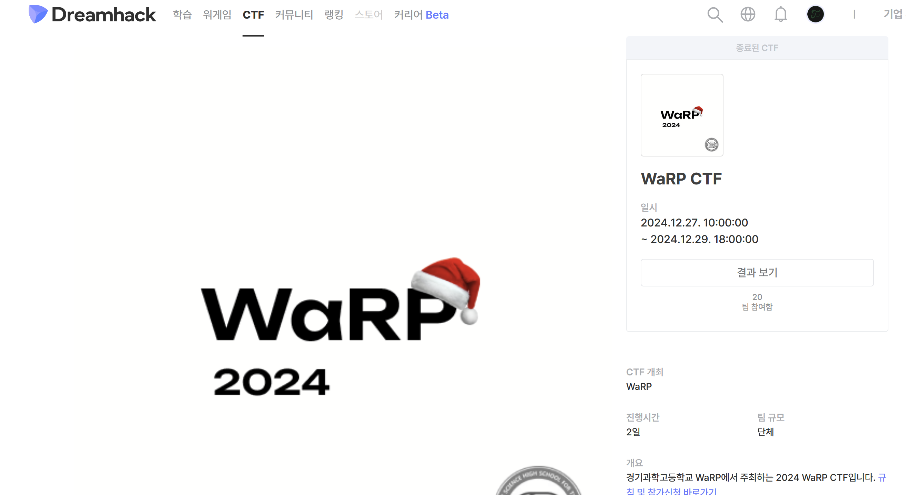

## WaRP CTF 2024
---



2024년 12월 27일부터 29일까지 2일 동안 진행된 경기과학고등학교 WaRP 주최의 WaRP CTF에 친구들과 함께 참여하였다. 웹하는 팀원 한 명의 버스로 어쩌다 1등까지 하게 되었는데 나는 리버싱 한 문제 풀이와 다른 팀원의 미스크 문제 풀이를 돕는 것 밖에 하지 못 했다. 출제된 리버싱 문제 중 하나를 업솔빙했지만 너무 심하게 버스 탄 것 같아서 다음에는 조금 더 분발하고자 한다.

## REV
---

### Obfuscation Basic 101


문제 파일을 다운로드 받은 후 ida를 통해 열면 위와 같은 엄청난 모습의 그래프 뷰를 볼 수 있다.  
자세히 보면 가장 위의 초기화 및 입력 블록 하나와 가장 아래 성공 또는 실패의 블록 두 개를 제외하면 중간의 70개의 블록이 모두 유사한 형태로 이루어져 있다는 것을 알 수 있다. (참고로 해당 문제 파일의 함수는 크기가 너무 커 ida에서는 디컴파일되지 않는다.)


위는 블록 하나의 모습인데 보면 알 수 있듯이 입력받은 문자열에서 특정 인덱스를 가져오고 어떠한 값과 곱한 후 레지스터 ebx에 계속해서 더한다. 위 이미지에서는 나오지 않았지만 블록의 가장 아래를 보면 이렇게 해서 정해진 ebx가 32bit의 어떠한 값과 레지스터 r15를 xor 연산한 결과와 일치하는지 검증하는 코드가 있고 다르면 프로그램을 종료하는 것을 볼 수 있다.

$$
\begin{bmatrix}
a_{0,0} & a_{0,1} & \cdots & a_{0,69} \\
a_{1,0} & a_{1,1} & \cdots & a_{1,69} \\
\vdots & \vdots & \ddots & \vdots \\
a_{69,0} & a_{69,1} & \cdots & a_{69,69}
\end{bmatrix}
\begin{bmatrix}
x_0 \\ x_1 \\ \vdots \\ x_{69}
\end{bmatrix}
=
\begin{bmatrix}
b_0 \\ b_1 \\ \vdots \\ b_{69}
\end{bmatrix}
$$

이를 통해 위의 식을 만족시키는 미지수를 찾으면 플래그를 구할 수 있다는 것을 알 수 있다.  
(여기서 $x$가 우리가 구하고자 하는 입력값, $a$는 입력값에 곱해지는 계수, $b$는 연산 결과이다.)

나의 경우 계수 및 결과 배열을 얻기 위해서 capstone 라이브러리를, 선형방정식을 풀기 위해 sagemath 언어를 사용했다. sagemath의 경우 ```from sage.all import *```을 통해 파이썬으로 사용 가능하기 때문에 계수 및 결과 배열을 구하는 코드와 선형방정식을 풀이하는 코드를 하나의 파이썬 코드로 작성해주었다.

```python frame='code' title='ex.py'
from capstone import *
from pwn import *
from sage.all import *

p = process('./main')
e = ELF('./main')
md = Cs(CS_ARCH_X86, CS_MODE_64)

main_addr = 0x2229
main_size = 0x2B733 - main_addr

main_code = e.read(main_addr, main_size)

data = [[0 for _ in range(70)] for _ in range(70)]
res = []
li = [i for i in range(0x46)]
l = list(tuple(li))
cnt = 0
eax = 0
r15 = 0
res = []

for i in md.disasm(main_code, main_addr):

    # print(f"0x{i.address:x}:\t{i.mnemonic}\t{i.op_str}")

    if i.mnemonic == 'movzx':
        eax = 1
        edx = 1
        continue

    if i.mnemonic == 'shl':
        eax <<= int(i.op_str[5:], 16)
        continue

    if i.mnemonic == 'add':
        if i.op_str == 'eax, eax':
            eax += eax
        elif i.op_str == 'eax, edx':
            eax += edx
        elif i.op_str == 'ebx, eax':
            data[cnt][esi] += eax
        continue

    if i.mnemonic == 'imul':
        if i.op_str[:8] == 'ebx, eax':
            eax *= int(i.op_str[10:], 16)
            data[cnt][esi] += eax
        elif i.op_str[:8] == 'eax, eax':
            eax *= int(i.op_str[10:], 16)
        continue

    if i.mnemonic == 'movabs':
        if i.op_str[:3] == 'rax':
            try:
                res.append(int(i.op_str[5:], 16))
            except:
                pass
        elif i.op_str[:3] == 'r15':
            r15 = int(i.op_str[5:], 16)
        continue

    if i.mnemonic == 'mov' and i.op_str[:3] == 'esi':
        esi = int(i.op_str[5:], 16)
        if len(l) == 0:
            l = list(tuple(li))
            cnt += 1
        l.remove(esi)
        continue

    if i.mnemonic == 'mov' and i.op_str == 'ebx, eax':
        data[cnt][esi] += eax
        continue

    if i.mnemonic == 'sub':
        if i.op_str == 'eax, edx':
            eax -= edx
        continue

    if i.mnemonic == 'lea':
        if i.op_str == 'edx, [rbx + rax]':
            data[cnt][esi] += eax
        elif i.op_str == 'ebx, [rax + rdx]':
            data[cnt][esi] += eax + edx
        elif i.op_str == 'ebx, [rax*4]':
            data[cnt][esi] += eax * 4
        elif i.op_str == 'edx, [rax*8]':
            edx = eax * 8
        elif i.op_str == 'edx, [rax*4]':
            edx = eax * 4
        continue

res = [i ^ r15 for i in res[1:71]]

A = Matrix(data)
B = vector(res)
x = A.solve_right(B)

print(''.join([chr(c) for c in x]))
```
최종 솔브 코드는 위와 같다. 이미 드림핵의 어떠한 비슷한 문제를 풀어본 적이 있었기에 쉽게 풀이할 수 있을 줄 알았으나 계수 및 결과 배열을 구하는 것에서 굉장한 삽질을 해 코드가 깔끔함과는 상당히 거리가 멀어졌다. 특히 계수 구할 때 80번째 줄부터 91번째 줄까지의 부분이 오류 찾기 매우 어려웠다.

## MISC
---

### Diary

```sh title='My_Dear_Diary.txt'
Today, I saved my secret in my Google Drive. Do you want to know what is in my google drive? I have the FLAGGGG.. and the things I learned in school. Of course, in case somebody broke into my Google Drive, I locked up my file with some secrets. You want the flag? Come and get it if you want. Since it's christmas season, I'll give you as a kind of Christmas present! But you will have to listen to my carol first.

I don't want a lot for Christmas
There is just one thing I need
I don't care about the presents underneath the Christmas tree
I just want you for my own
More than you could ever know
Make my wish come true
All I want for Christmas is you
Yeah
I don't want a lot for Christmas
There is just one thing I need (and I)
Don't care about the presents underneath the Christmas tree
I don't need to hang my stocking there upon the fireplace
Santa Claus won't make me happy with a toy on Christmas Day
I just want you for my own
More than you could ever know
Make my wish come true
All I want for Christmas is you
You, baby
Oh, I won't ask for much this Christmas
I won't even wish for snow (and I)
I'm just gonna keep on waiting underneath the mistletoe
I won't make a list and send it to the North Pole for Saint Nick
I won't even stay awake to hear those magic reindeer click
'Cause I just want you here tonight
Holding on to me so tight
What more can I do?
Oh, baby, all I want for Christmas is you
You, baby
Oh-oh, all the lights are shining so brightly everywhere
And the sound of children's laughter fills the air
And everyone is singing
I hear those sleigh bells ringing
Santa, won't you bring me the one I really need?
Won't you please bring my baby to me?
Oh, I don't want a lot for Christmas
This is all I'm asking for
I just wanna see my baby standing right outside my door
Oh, I just want you for my own
More than you could ever know
Make my wish come true
Oh, baby, all I want for Christmas is you
You, baby
All I want for Christmas is you, baby
All I want for Christmas is you, baby
All I want for Christmas is you, baby
All I want for Christmas is you, baby
All I want for Christmas is you, baby
```

문제 파일을 다운로드 받으면 위와 같은 내용의 텍스트 파일을 볼 수 있다. 자신의 비밀을 구글 드라이브에 숨겼으니 원하면 가져가라는 것인데 그 아래 어떤 크리스마스 캐롤의 가사가 적혀 있다. 위에는 없지만 직접 파일을 출력해보면 캐롤 아랫부분에 알 수 없는 여백들이 존재한다는 것을 알 수 있는데 이를 수상히 여기고 헥스 에디터를 통해 열어보면 아래와 같다.


```E2 A0 80```과 ```20```이 반복된다. 이것을 보고 각각을 0과 1로 치환해보면 이진수 문자열을 얻을 수 있으며 이를 아스키 코드로 변환하면 base64로 인코딩된 문자열을 얻을 수 있다.

```python frame='code' title='conv.py'
bin_code = 'E2 A0 80 20 20 E2 A0 80 ... 중략 ... E2 A0 80 20 20 20 20 E2 A0 80 20'

bin_code = bin_code.replace('E2 A0 80', '0')
bin_code = bin_code.replace('20', '1')
bin_code = bin_code.replace(' ', '')

for i in range(0, len(bin_code), 8):
    print(chr(int(bin_code[i:i+8], 2)), end = '')
```
base64 디코딩하면 어떤 구글 드라이브 주소가 나오고 이에 접속하면 ```flag.zip```, ```password.zip```, ```My_Study```가 존재하며 각각의 zip 파일은 비밀번호로 막혀있다. ```My_Study``` 폴더 안에는 ```Calculus```, ```Differential_Equations```, ```Linear_Algebra```, ```Number_Theory```라는 폴더가 존재하는데 각각의 폴더에는 ```https://www.youtube.com/watch?v=BQS?8F#ks-GB\6`D.R6l@:j4```와 같이 ```v=``` 뒷 부분이 이상한 문자열로 된 링크들이 존재한다. 각각의 이상한 문자열들을 base85 방식으로 디코딩하면 어떤 파일을 다운받을 수 있는 링크가 나오고 그 링크에서의 파일의 내용을 통해 ```password.zip``` 파일을 열 수 있다.

```sh title='password.txt'
ჰიצპოპץტომონსტროსესქუიპპედალიע
```

여기까지(사실상 전부)는 팀원들이 풀이한 부분이고 아래부터가 내가 풀이한 부분인데 이것조차도 살짝 이상하게 푼 것 같다. ```password.txt``` 파일을 보면 위와 같이 이해할 수 없는 조지아어 및 히브리어로 이루어진 30글자 문자열이 존재한다. 이 부분을 해독하는 것에 많은 삽질을 하였고 결국 28일 오후 5시가 되어 힌트를 받을 수 있었는데 해당 문자열을 영어 알파벳으로 치환한 것이 flag.zip의 패스워드라는 것이었다. 이 말을 듣고 나무위키의 조지아어 문서의 문자 목록 표를 보고 글자 이름의 첫 글자로 치환을 해주었는데 그 내용은 아래와 같다.

```sh title='password?'
hitpopFTtomonstroseskuippedalia
hitpoptomonstroseskuippedalia
hitpopfomonstroseskuippedalia
ჰიצპოპץტომონსტროსესქუიპპედალიע
```

대충 봐도 뭔가 이상하지만 이 뭔가 이상한 결과의 치환 문자열을 보고 ```길이가 긴 단어 공포증```을 떠올릴 수 있었다. 여기서도 약간의 삽질이 있었지만 넘어가면 패스워드는 ```hippopotomonstrosesquippedalio```라는 것을 알 수 있었다.


이제 진짜 다 왔다는 생각으로 ```flag.zip``` 내의 파일 ```flag.pdf```을 열면 위와 같은 이미지를 볼 수 있다! 플래그 포맷이 ```WaRP{}```이기 때문에 앞의 5글자로 키를 구할 수 있었고 드디어 플래그를 구할 수 있었다.

```python frame='code' title='ex.py'
flag = list(bytes.fromhex('620c66222f0d540511370759504064000f074a61065e054230025e0713600c5d041431510f49'))

key = []
key.append(flag[0] ^ ord('W'))
key.append(flag[1] ^ ord('a'))
key.append(flag[2] ^ ord('R'))
key.append(flag[3] ^ ord('P'))
key.append(flag[4] ^ ord('{'))

for i in range(len(flag)):
    print(chr(flag[i] ^ key[i % len(key)]), end = "")
```

## Comment
---

처음으로 수상한 대회로서 기분은 좋지만 리버싱 공부를 더 열심히 해야겠다는 생각을 가지게 되었다. 추가로 팀원도 해당 대회에 대한 [라이트업](https://goldleo1.github.io/posts/warp-ctf-2024/)을 작성하였는데 매우 잘하는 친구이니 한 번 봐보도록 하자. 