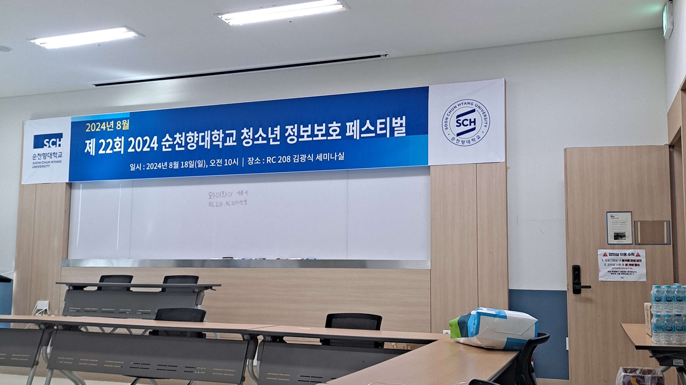
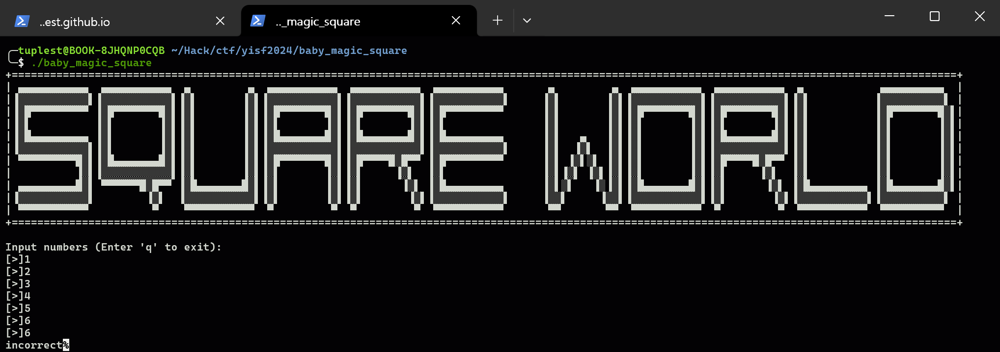
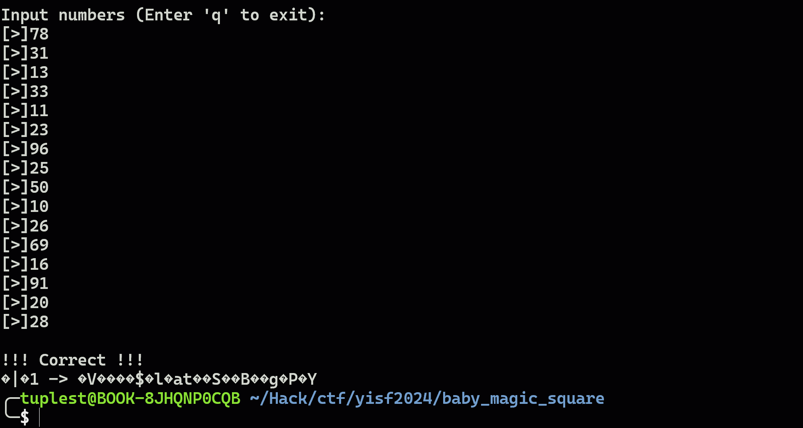
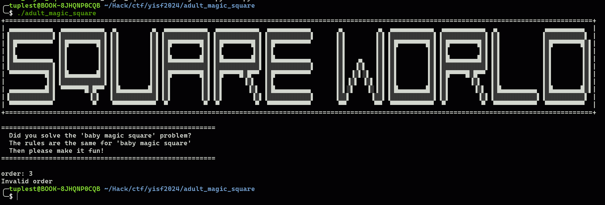

## YISF 2024
---



제 22회 청소년 정보보호 페스티벌에 참가하여 예선전을 치루고 본선 진출 18명 중 18등으로 본선에 참가했었다. 당시 정션 아시아 및 데프콘과 같은 대회들이 겹쳐 분산된 탓에 실력이 턱없이 부족했던 나도 본선에 운좋게 참여할 수 있게 되었었다. 본선에서 출제된 리버싱 문제 3문제 중 1번 문제를 제외하고는 아무 것도 풀지 못 하였었고 미스크로 출제된 osint 문제를 하나 풀었었는데 어느 정도 실력을 쌓은 지금 리버싱 문제들을 다시 보니 ~~상당한 바보짓과 함께~~ 생각보다 수월하게 풀 수 있었고 다섯 달이 지난 지금에서야 라이트업을 작성하고자 한다. 당시 구글링 실력의 문제가 컸겠지만 ctf 대회 라이트업에 대해 다른 분야에 비해 리버싱이 적다는 생각에 안타까워 했었는데 이제는 내 손으로 적을 수 있게 되어 뿌듯하다는 마음이 든다.

## Anyone can do it
---

```python frame='code' title='Anyone.py'
import random as SiYiYsFyIsFySiFYfSiYsFyIsFfYiS
SiYiYsFyIsFySiFYfSiYsFyIsFYiS = int("524899f", 18)
SiYiYsFyIsFySiFYfSiYsFyIsFfYiS.SiYiYsFyIsFySiFYfSiYsFyIsFYiS(SiYiYsFyIsFySiFYfSiYsFyIsFYiS)

SiYiYsFyIsFySiFYfSiYsFyIs = bytearray(open('flag.txt', 'rb').read())

YiYfSiYsFyIsFfYSyFyIsFyYsIsFy = 'a6f0bbebb1f3ba370fb15150e26c0e00066c46bd26b1f1f77237d0e45fddb7f7'

YiYSiYSfYfSiYsFsISiFyYs = [
    b'YiYisFiFySiYsFsI',
    b'IfYfSiYySi',
    b'IyFsIyFySiF',
    b'SiFyYsFfYs',
    b'IfFyFsYiSfYs',
    b'YiYisFiFySiYySfS',
    b'IfYfSiYys',
    b'FyFsIyIysI',
    b'SfYsIfyFyIyS',
]

def IfYiSfSiFyYsFfSYiYfSiYsFyIsFfY(IiFyYsFfSYiYfSiYsFyIsFfY):
    return bytearray([YiYFIfYiSfSiFyYsFfSYiYfSiYsFyIsFfY ^ 0xAA for YiYFIfYiSfSiFyYsFfSYiYfSiYsFyIsFfY in IiFyYsFfSYiYfSiYsFyIsFfY])

def IfYiSfSiFyYsFfSYiYfSiYsFyiSFFY(IfYisFsIFyYsFfSYiYfSiYsFyIsFfY):
    return bytearray([YiYfSiYsFyIsFfYSyFyIsF ^ 0x55 for YiYfSiYsFyIsFfYSyFyIsF in IfYisFsIFyYsFfSYiYfSiYsFyIsFfY])

def YfSiYsFyIsFfYiSIfYiSfSiFyYsFfS(hex):
    for id in range(0, len(hex) - 2, 2):
        hex[id], hex[id + 2] = hex[id + 2], hex[id]
    for list in range(1, len(hex) - 2, 2):
        hex[list], hex[list + 2] = hex[list + 2], hex[list]
    return hex


YfSiYsFyIsFfYiSIf = [YfSiYsFyIsFfYiSIfYiSfSiFyYsFfS, IfYiSfSiFyYsFfSYiYfSiYsFyIsFfY, IfYiSfSiFyYsFfSYiYfSiYsFyiSFFY]
YfSiYsFyIsFfYiSIf = [SiYiYsFyIsFySiFYfSiYsFyIsFfYiS.choice(YfSiYsFyIsFfYiSIf) for _ in range(256)]

def YiYfSiYsFfSiFySFySiYiFfYsFySiF(YfSiYsFyIsFfYiSIfYiSfSiFyYsFfS, YsFySiYiIsFyFfSSiYiYsFyIsFySiF):
    YsFySiYiIsFyFfSSiYiYsFyIsFySiF = [int(YsFySiYiIsFyFfSSiYiYsFyIsFySiF[i:i+2], 16) for i in range(0, len(YsFySiYiIsFyFfSSiYiYsFyIsFySiF), 2)]
    for i in YsFySiYiIsFyFfSSiYiYsFyIsFySiF:
        YfSiYsFyIsFfYiSIfYiSfSiFyYsFfS = YfSiYsFyIsFfYiSIf[i % len(YfSiYsFyIsFfYiSIf)](YfSiYsFyIsFfYiSIfYiSfSiFyYsFfS)

    return YfSiYsFyIsFfYiSIfYiSfSiFyYsFfS


def YiYsFyIsFySiFfYsF(YfSiYsFyIsFfYiSIfYiSfSiFyYsFfS, YsFySiYiIsFyFfSSiYiYsFyIsFySiF):
    YsFySiYiIsFyFfSSiYiYsFyIsFySiF = int(YsFySiYiIsFyFfSSiYiYsFyIsFySiF.hex(), 18)
    for i in YfSiYsFyIsFfYiSIfYiSfSiFyYsFfS:
        num = int.from_bytes(i, byteorder='big')
        YsFySiYiIsFyFfSSiYiYsFyIsFySiF += num
    ar_hex = hex(YsFySiYiIsFyFfSSiYiYsFyIsFySiF)
    return ar_hex 

def YiYsFyIsFySiFfYsFs(YfSiYsFyIsFfYiSIfYiSfSiFyYsFfS, YsFySiYiIsFyFfSSiYiYsFyIsFySiF):
    result = bytearray()
    for i, a in enumerate(YfSiYsFyIsFfYiSIfYiSfSiFyYsFfS):
        if i % 2 == 0:
            result.append(a | 0x57)
        else:
            result.append(a ^ 0x57)
    return result

YiYsFySiFyIsSSiYsFyIsFyYiFfS = YiYfSiYsFfSiFySFySiYiFfYsFySiF(SiYiYsFyIsFySiFYfSiYsFyIs, YiYfSiYsFyIsFfYSyFyIsFyYsIsFy)
YiYsFySiFyIsSSiYsFyIsFyYiFfS = YiYsFyIsFySiFfYsF(YiYSiYSfYfSiYsFsISiFyYs, YiYsFySiFyIsSSiYsFyIsFyYiFfS)
print(YiYsFySiFyIsSSiYsFyIsFyYiFfS)
```

```sh title='output.txt'
2b2dd9afa833f7a96dbfb8defdd2e25f86e3e6bcf45b5a3040855f30ff0faba63c982259cf5df440993043
```

문제 파일을 다운로드 받으면 위와 같이 yisf로 난독화되어 있는 파이썬 파일 ```Anyone.py```와 파이썬 파일의 실행 결과로 보여지는 ```output.txt```가 존재한다.  

보기에는 매우매우 복잡하지만 실제로는 그렇지 않기에 분석하기 위해서 난독화를 읽기 편한 상태로 바꿔줘야 하는데 나의 경우에는 그냥 vscode 편집기에서 ```ctrl + d```를 통해 이름을 바꿔주었다.

```python frame='code' title='Anyone.py'
import random

random.seed(int("524899f", 18))

flag = bytearray(open('flag.txt', 'rb').read())

hex_string = 'a6f0bbebb1f3ba370fb15150e26c0e00066c46bd26b1f1f77237d0e45fddb7f7'

sub_keys = [
    b'YiYisFiFySiYsFsI',
    b'IfYfSiYySi',
    b'IyFsIyFySiF',
    b'SiFyYsFfYs',
    b'IfFyFsYiSfYs',
    b'YiYisFiFySiYySfS',
    b'IfYfSiYys',
    b'FyFsIyIysI',
    b'SfYsIfyFyIyS',
]

def xor_with_AA(data):
    return bytearray([b ^ 0xAA for b in data])

def xor_with_55(data):
    return bytearray([b ^ 0x55 for b in data])

def shuffle(data):
    for i in range(0, len(data) - 2, 2):
        data[i], data[i + 2] = data[i + 2], data[i]
    for i in range(1, len(data) - 2, 2):
        data[i], data[i + 2] = data[i + 2], data[i]
    return data

funcs = [shuffle, xor_with_AA, xor_with_55]
funcs = [random.choice(funcs) for _ in range(256)]

def main_op(data, hex_string):
    hex_string = [int(hex_string[i:i+2], 16) for i in range(0, len(hex_string), 2)]
    for i in hex_string:
        data = funcs[i % len(funcs)](data)
    return data

def add_op(data, f):
    f = int(f.hex(), 18)
    for i in data:
        num = int.from_bytes(i, byteorder='big')
        f += num
    ar_hex = hex(f)
    return ar_hex

f = main_op(flag, hex_string)
f = add_op(sub_keys, f)
print(f)
```

코드가 그리 길지 않기 때문에 조금씩 이해하면서 이름을 하나하나 바꿔주고 필요 없는 부분을 삭제하면 위와 같이 나타낼 수 있다. (gpt가 상당히 난독화를 잘 풀어주는데 완벽하지 않아 크로스 체크는 필수지만 굉장히 편해진다.)

난독화가 풀린 코드를 분석해보자면 랜덤 시드를 설정해주고, 플래그 가공에 필요한 여러 데이터를 정의해준 후 3가지 함수들을 통해 랜덤한 순서로 플래그를 가공해준다. 이 플래그에 어떤 값들을 더해준 뒤 출력해준다. 우리는 이미 output.txt를 받았고 플래그를 암호화하는 코드를 이해했기 때문에 그대로 거꾸로 실행해주는 역연산 코드를 작성해주면 플래그를 구할 수 있다.

```python frame='code' title='ex.py'
import random

random.seed(int("524899f", 18))

flag = 0x2b2dd9afa833f7a96dbfb8defdd2e25f86e3e6bcf45b5a3040855f30ff0faba63c982259cf5df440993043

hex_string = 'a6f0bbebb1f3ba370fb15150e26c0e00066c46bd26b1f1f77237d0e45fddb7f7'

sub_keys = [
    b'YiYisFiFySiYsFsI',
    b'IfYfSiYySi',
    b'IyFsIyFySiF',
    b'SiFyYsFfYs',
    b'IfFyFsYiSfYs',
    b'YiYisFiFySiYySfS',
    b'IfYfSiYys',
    b'FyFsIyIysI',
    b'SfYsIfyFyIyS',
]

def to_18(num):
    charset = '0123456789abcdefg'
    ret = ''
    while num > 0:
        ret = charset[num % 18] + ret
        num //= 18
    return ret

def xor_with_AA(data):
    return bytearray([b ^ 0xAA for b in data])

def xor_with_55(data):
    return bytearray([b ^ 0x55 for b in data])

def reverse(data):
    for i in range(len(data) - 3, -1, -2):
        data[i], data[i + 2] = data[i + 2], data[i]
    for i in range(len(data) - 4, 0, -2):
        data[i], data[i + 2] = data[i + 2], data[i]
    return data

funcs = [reverse, xor_with_AA, xor_with_55]
funcs = [random.choice(funcs) for _ in range(256)]

def main_op(data, hex_string):
    hex_string = [int(hex_string[i:i + 2], 16) for i in range(0, len(hex_string), 2)]
    for i in hex_string[::-1]:
        data = funcs[i % len(funcs)](data)
    return data

def add_op(sub_keys, f):
    for i in sub_keys:
        num = int.from_bytes(i, byteorder = 'big')
        f -= num
    return bytearray.fromhex(to_18(f))

f = add_op(sub_keys, flag)
f = main_op(f, hex_string)

print(f.decode())
```

여담으로 대회 당시 솔브 코드와 지금의 솔브 코드가 차이가 많이 나는데 당시에는 ```shuffle``` 함수의 역연산 코드도 잘못 작성했을 뿐만 아니라 가장 위의 코드가 시드 설정이라는 걸 이해 못 해서 모든 경우의 수에서 플래그를 찾는 방법으로 풀이했었다.

## baby magic square
---



제목에서부터 어떤 프로그램인지 힌트를 주는 문제이기 때문에 실행만으로도 많은 정보를 얻을 수 있다. 총 16번의 입력을 받고 ```incorrect```를 출력해주는데 최대 16번의 입력을 받는 것을 통해 4 * 4의 마방진을 그리는 문제라고 추측할 수 있다.

```c frame='code' title='baby_magic_square'
__int64 __fastcall main(int a1, char **a2, char **a3)
{
  char v4; // [rsp+7h] [rbp-29h]
  int i; // [rsp+8h] [rbp-28h]
  int j; // [rsp+Ch] [rbp-24h]
  int v7[6]; // [rsp+10h] [rbp-20h] BYREF
  unsigned __int64 v8; // [rsp+28h] [rbp-8h]

  v8 = __readfsqword(0x28u);
  puts(opening);
  sub_1526(dword_5180, &unk_51C0);
  v4 = 1;
  for ( i = 0; i <= 3; ++i )
  {
    for ( j = 0; j <= 3; ++j )
    {
      if ( (unsigned __int8)sub_11E9(dword_5180[4 * i + j], &unk_51C0, 16LL) != 1 )
      {
        v4 = 0;
        break;
      }
    }
  }
  putchar(10);
  if ( v4 && (unsigned __int8)sub_1326(dword_5180) )
  {
    puts("!!! Correct !!!");
    sub_17AC((__int64)&unk_5040, 8, dword_51A8);
    sub_17AC((__int64)&unk_5080, 8, dword_5198);
    sub_17AC((__int64)&unk_50C0, 8, dword_51A4);
    sub_17AC((__int64)&unk_5100, 10, dword_51A0);
    v7[0] = dword_5020;
    v7[1] = dword_5024;
    v7[2] = dword_5028;
    v7[3] = dword_502C;
    printf("Flag -> ");
    sub_183B(&unk_5040, 8LL, v7);
    sub_183B(&unk_5080, 8LL, v7);
    sub_183B(&unk_50C0, 8LL, v7);
    sub_183B(&unk_5100, 10LL, v7);
    putchar(10);
  }
  else
  {
    puts("incorrect");
  }
  return 0LL;
}
```

분석은 생각보다 정말 별 거 없다. 마방진이라는 걸 생각하고 추측(guessing)을 섞어 분석하면 금방 문제를 파악할 수 있다. `main` 함수는 위와 같은데 조건을 만족하는(`sub_11E9`) 값만 입력받고 마방진이 맞는지(`sub_1326`) 검사한 후 플래그를 출력한다.

```c frame='code' title='sub_11E9'
_BOOL8 __fastcall sub_11E9(int a1, __int64 a2, int a3)
{
  char v4; // [rsp+1Fh] [rbp-11h]
  int i; // [rsp+20h] [rbp-10h]
  int v6; // [rsp+24h] [rbp-Ch]
  int v7; // [rsp+28h] [rbp-8h]

  v6 = a1 % 10;
  v7 = a1 / 10 % 10;
  if ( a1 % 10 == 1 || v7 == 1 )
    return 1LL;
  if ( v6 == 5 || v7 == 5 )
    return 1LL;
  if ( v6 == 8 || v7 == 8 )
    return 1LL;
  if ( v6 == 2 || v7 == 2 )
    return 1LL;
  v4 = 0;
  for ( i = 0; i < a3; ++i )
  {
    if ( 10 * v6 + v7 == *(_DWORD *)(4LL * i + a2) )
    {
      v4 = 1;
      return v4 == 1;
    }
  }
  return v4 == 1;
}
```

첫 번째 조건 함수이다. 입력받는 수의 1의 자릿수 또는 10의 자릿수에 ```[1, 2, 5, 8]``` 중 하나의 숫자가 존재**하거나** 마방진 내에 1의 자릿수와 10의 자릿수를 거꾸로 뒤집은 숫자가 존재해야 한다.

```c frame='code' title='sub_1326'
bool __fastcall sub_1326(_DWORD *a1)
{
  int i; // [rsp+Ch] [rbp-2Ch]
  int j; // [rsp+10h] [rbp-28h]
  int v4; // [rsp+14h] [rbp-24h]
  int k; // [rsp+18h] [rbp-20h]
  int m; // [rsp+1Ch] [rbp-1Ch]
  int v7; // [rsp+20h] [rbp-18h]
  int n; // [rsp+24h] [rbp-14h]
  int v9; // [rsp+28h] [rbp-10h]
  int ii; // [rsp+2Ch] [rbp-Ch]
  int v11; // [rsp+30h] [rbp-8h]
  int jj; // [rsp+34h] [rbp-4h]

  for ( i = 0; i <= 3; ++i )
    dword_5200 += a1[i];
  for ( j = 1; j <= 3; ++j )
  {
    v4 = 0;
    for ( k = 0; k <= 3; ++k )
      v4 += a1[4 * j + k];
    if ( v4 != dword_5200 )
      return 0;
  }
  for ( m = 0; m <= 3; ++m )
  {
    v7 = 0;
    for ( n = 0; n <= 3; ++n )
      v7 += a1[4 * n + m];
    if ( v7 != dword_5200 )
      return 0;
  }
  v9 = 0;
  for ( ii = 0; ii <= 3; ++ii )
    v9 += a1[4 * ii + ii];
  if ( v9 != dword_5200 )
    return 0;
  v11 = 0;
  for ( jj = 0; jj <= 3; ++jj )
    v11 += a1[4 * jj + 3 - jj];
  return v11 == dword_5200 && (dword_5200 <= 167 || a1[9] + a1[10] == 76) && a1[9] + a1[6] + a1[5] + a1[10] != 0;
}
```

두 번째 조건 함수이다. 위의 반복문들은 별 거 없이 마방진의 기본적인 조건인 합이 일정한가를 판단하는 반복문들이다. 중요한 것은 ```return```의 조건들로 보이는 것과 같은 특별한 조건을 추가해준다.

지금까지 얻은 조건들을 파이썬 라이브러리 ```z3-solver```에 다 넣은 후 ```s.model()```로 적절한 입력값을 구해주면 된다.

```python frame='code' title='ex.py'
from z3 import *

s = Solver()

grid = [[Int(f'x_{i}_{j}') for j in range(4)] for i in range(4)]
sum = Int('sum')

def check(n):
    valid = [1, 2, 5, 8]

    ten = (n / 10) % 10
    one = n % 10
    rev_num = one * 10 + ten

    cond1 = Or([ten == v for v in valid] + [one == v for v in valid])
    cond2 = Or([grid[i][j] == rev_num for i in range(4) for j in range(4)])

    return Or(cond1, cond2)

for i in range(4):
    for j in range(4):
        s.add(And(10 <= grid[i][j], grid[i][j] <= 99))

# 모든 값은 다름
s.add(Distinct([grid[i][j] for i in range(4) for j in range(4)]))

# 행의 합은 모두 같음
for i in range(4):
    s.add(Sum([grid[i][j] for j in range(4)]) == sum)

# 열의 합은 모두 같음
for j in range(4):
    s.add(Sum([grid[i][j] for i in range(4)]) == sum)

# 대각선의 합은 모두 같음
s.add(Sum([grid[i][i] for i in range(4)]) == sum)
s.add(Sum([grid[i][3 - i] for i in range(4)]) == sum)

s.add(Or(sum <= 167, grid[2][1] + grid[2][2] == 76))

# 말로 형용하기 어려움
for i in range(4):
    for j in range(4):
        s.add(check(grid[i][j]))

# s.add(grid[1][2] == 18)
# s.add(grid[2][0] == 88)
# s.add(grid[2][2] == 55)
# s.add(grid[2][1] == 21)

if s.check() == sat:
    model = s.model()
    for i in range(4):
        for j in range(4):
            print(model[grid[i][j]].as_long(), end = " ")
else:
    print("No solution exists")
```

문제는 여기서 발생한다. 분명히 ```Correct !!```를 출력해주는 입력값을 구했음에도 불구하고 플래그가 모두 깨져서 나오는 현상이 발생한다.



위의 이미지와 같이 플래그가 깨져서 나오는데 이를 이해하기 위해서는 ida에서 플래그를 출력해주는 코드를 분석해보아야 한다.

```c frame='code' title='print flag'
puts("!!! Correct !!!");
sub_17AC((__int64)&unk_5040, 8, dword_51A8);
sub_17AC((__int64)&unk_5080, 8, dword_5198);
sub_17AC((__int64)&unk_50C0, 8, dword_51A4);
sub_17AC((__int64)&unk_5100, 10, dword_51A0);
v7[0] = dword_5020;
v7[1] = dword_5024;
v7[2] = dword_5028;
v7[3] = dword_502C;
printf("Flag -> ");
sub_183B(&unk_5040, 8LL, v7);
sub_183B(&unk_5080, 8LL, v7);
sub_183B(&unk_50C0, 8LL, v7);
sub_183B(&unk_5100, 10LL, v7);
putchar(10);
```

플래그를 출력해주는 코드인데 여기서 ```sub_17AC```는 첫 번째 인자에 세 번째 인자를 xor 연산해주는 함수(첫 번째 인자는 가공되기 전의 플래그를 4개로 쪼갠 것, 두 번째 인자는 길이, 세 번째 인자는 **입력값의 특정 요소**이다.)이고 ```sub_183B```은 인자들을 가공하고 출력해주는 함수이다. 즉, ```sub_183B```에서 출력되는 것이 바로 플래그인데 이 플래그를 가공하는 것에 입력값의 특정 요소이고 ```Correct !!```를 출력해주는 입력값은 경우의 수가 다양한 반면 올바르게 플래그를 출력해주도록 하는 입력값은 정해져 있기 때문에 플래그가 깨져서 나오는 것이다.

이를 해결하기 위해서는 다양한 방법이 있겠지만 생각보다 ```Correct !!```를 출력해주는 경우의 수가 많기 때문에 계속해서 제약 조건을 추가해서 될 때까지 다양한 해를 구하는 방법보다는 입력값이 두 자릿수 정수이고 플래그에 영향을 주는 것은 입력값 16개 중 4개라는 것을 고려하여 플래그를 출력해주는 함수를 그대로 가져오고 브루트 포싱을 하는 것이 훨씬 더 효율적이다. 위 솔브 코드에서 주석 처리되어 있는 46 ~ 49번째 줄의 제약 조건이 올바른 플래그를 출력하게 해주는 입력값에 대한 제약 조건이다. (브루트 포싱으로 구하고 추가해주었다.)

\+ 아직도 ```Flag ->```가 깨진 이유는 모르겠다.

## adult magic square
---



오히려 baby보다 쉬운 것 같은 느낌이 드는 문제이다. 실행해보면 baby와 표면적으로는 두 가지 차이점이 존재하는데 첫 번째는 ```order```를 입력받는다는 것, 두 번째는 입력받는 수의 개수가 37이라는 점이다. 이를 인지하고 분석에 들어가면 이 또한 분석은 그렇게 어렵지 않다. ```order```의 경우 위 스크린샷에서 보이듯 4가 아니면 프로그램이 종료되기 때문에 4로 고정된다.

```c frame='code' title='main'
__int64 __fastcall main(__int64 a1, char **a2, char **a3)
{
  void **v3; // rbx
  int order; // [rsp+8h] [rbp-48h] BYREF
  int i; // [rsp+Ch] [rbp-44h]
  int j; // [rsp+10h] [rbp-40h]
  int k; // [rsp+14h] [rbp-3Ch]
  int m; // [rsp+18h] [rbp-38h]
  int n; // [rsp+1Ch] [rbp-34h]
  int ii; // [rsp+20h] [rbp-30h]
  int n_7; // [rsp+24h] [rbp-2Ch]
  int v13; // [rsp+28h] [rbp-28h]
  int v14; // [rsp+2Ch] [rbp-24h]
  _DWORD **ptr; // [rsp+30h] [rbp-20h]
  unsigned __int64 v16; // [rsp+38h] [rbp-18h]

  v16 = __readfsqword(0x28u);
  setbuf(a1, a2, a3);
  puts(off_6010);
  puts(off_6018);
  order = 0;
  printf("order: ");
  __isoc99_scanf("%d", &order);
  if ( order != 4 )
  {
    puts("Invalid order");
    exit(0);
  }
  n_7 = 7;
  ptr = (_DWORD **)malloc(56uLL);
  for ( i = 0; i < n_7; ++i )
  {
    v3 = (void **)&ptr[i];
    *v3 = malloc(4LL * (order + i));
  }
  puts("Input numbers:");
  for ( j = 0; j < order; ++j )
  {
    for ( k = 0; k < order + j; ++k )
    {
      printf("[>]");
      __isoc99_scanf("%d", &ptr[j][k]);
    }
  }
  for ( m = order; m < 2 * order - 1; ++m )
  {
    v13 = 2 * order - 1 + ~m + order;
    v14 = m - order + 1;
    for ( n = 0; n < v13; ++n )
    {
      printf("[>]");
      __isoc99_scanf("%d", &ptr[m][n + v14]);
    }
  }
  puts("\nChecking conditions");
  if ( !sub_1576(ptr, order) )
  {
    puts("Be unsuccessful :(");
  }
  else
  {
    puts("!!!!! Be Successful !!!!! :)");
    print_flag();
  }
  for ( ii = 0; ii < n_7; ++ii )
    free(ptr[ii]);
  free(ptr);
  return 0LL;
}
```

입력받는 코드를 보면 반복문 2개를 통해서 입력받는다. 별찍기 코드를 읽는다는 마음가짐으로 코드를 천천히 읽어보면 아래와 같이 7 * 7의 마방진을 아래와 같은 형태로 입력받는다는 것을 알 수 있다.

```frame='terminal' title='example'
n  n  n  n  0  0  0
n  n  n  n  n  0  0
n  n  n  n  n  n  0
n  n  n  n  n  n  n
0  n  n  n  n  n  n
0  0  n  n  n  n  n
0  0  0  n  n  n  n
```

```7 * 7 - 12(0으로 고정된 요소) == 37```이라는 점에서 아까 직접 실행을 통해 확인한 입력 개수 37과 일치한다는 것을 알 수 있다. 여기까지 왔으면 사실상 다 푼 것으로 adult의 경우 baby와 달리 만족시키는 입력값을 구하면 바로 플래그를 출력해주기 때문에 마방진이라는 점을 감안하고 조건을 분석한 후 ```z3-solver``` 돌리면 풀 수 있다.

```c frame='code' title='sub_1576'
_BOOL8 __fastcall sub_1576(_DWORD **ptr, int order)
{
  unsigned int sum; // [rsp+1Ch] [rbp-14h]
  signed int i; // [rsp+20h] [rbp-10h]
  int n_37; // [rsp+24h] [rbp-Ch]

  n_37 = 3 * order * (order - 1) + 1;
  if ( !calloc(n_37, 4uLL) )
  {
    fwrite("Invalid memory allocation\n", 1uLL, 0x1AuLL, stderr);
    exit(1);
  }
  if ( (unsigned __int8)sub_1745((__int64)ptr, order, n_37) != 1 )// 2 < num <= 39
    return 0LL;
  if ( !sub_1819(ptr, order, n_37) )            // 중복되는 수 존재x
    return 0LL;
  sum = 0;
  for ( i = 0; i < order; ++i )
    sum += (*ptr)[i];
  printf("sum_firstline %d\n", sum);
  if ( !sub_194C(ptr, order, sum)
    || (unsigned __int8)sub_1A36(ptr, (unsigned int)order, sum) != 1// 0 ~ 4 합 ==
    || (unsigned __int8)sub_1ACF(ptr, (unsigned int)order, sum) != 1 )
  {
    return 0LL;
  }
  return ptr[2][3] + ptr[3][3] == **ptr && 2 * ptr[4][3] == ptr[3][3];
}
```

위 사진은 조건을 다루는 함수인데 분석 생략하고 조건만 말하자면 아래와 같다.
1. 입력받는 수는 2 초과 39 이하이다.
2. 중복되는 수는 존재하지 않는다.
3. 가로 세로 총합이 일정하다.
4. **우하향의 모든 대각선의 총합 또한 일정하다.**
5. 각 함수의 리턴 부분에서 추가되는 특별한 조건들

이제 다 풀었다. 조건들 모두 ```z3-solver```에 넣고 해를 구한 후 접속해서 입력하면 플래그가 출력된다.

```python frame='code' title='ex.py'
from z3 import *

s = Solver()

grid = [[Int(f'x_{i}_{j}') for j in range(7)] for i in range(7)]
sum = Int('sum')

# 최대 최소 정의 및 zero_cell 정의
for i in range(7):
    for j in range(7):
        if abs(i - j) >= 4:
            s.add(grid[i][j] == 0)
        else:
            s.add(And(2 < grid[i][j], grid[i][j] <= 39))

# zero_cell 제외 모두 다름
s.add(Distinct([grid[i][j] for i in range(7) for j in range(7) if abs(i - j) < 4]))

# 행의 합 같음
for i in range(7):
    s.add(Sum([grid[i][j] for j in range(7)]) == sum)

# 열의 합 같음
for j in range(7):
    s.add(Sum([grid[i][j] for i in range(7)]) == sum)

# 대각선의 합 같음
for k in range(-3, 4):
    s.add(Sum([grid[i][j] for i in range(7) for j in range(7) if i - j == k]) == sum)

# return에서의 조건들
s.add(grid[0][0] == 10)
s.add(And(grid[1][3] == 26, 6 * grid[2][3] == grid[0][1]))
s.add(grid[5][3] == 11)
s.add(And(grid[6][4] == 31, And(grid[6][6] == 33, grid[0][3] == 39)))
s.add(And(grid[2][3] + grid[3][3] == grid[0][0], 2 * grid[4][3] == grid[3][3]))

# 힌트 제공
# s.add(sum == 111)

if s.check() == sat:
    model = s.model()
    for i in range(7):
        for j in range(7):
            print(model[grid[i][j]].as_long(), end = " ")
else:
    print("No solution exists")
```

39번째 줄의 제약 조건(magic_sum == 111)은 당시 대회 중 힌트로 올라온 조건으로 문제에 대한 힌트라기보다는 ```z3-solver```가 해를 구하는 시간을 대폭 감소시켜주는 조건이다.