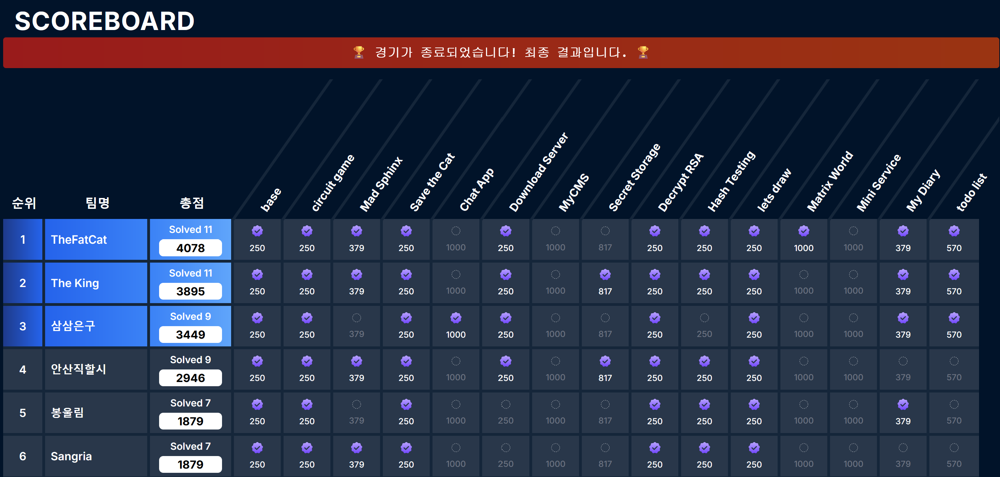
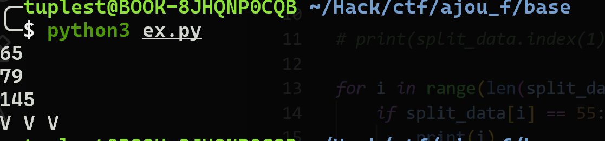
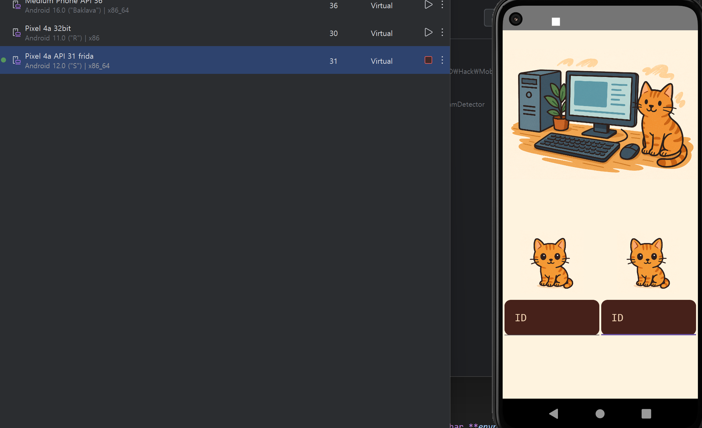
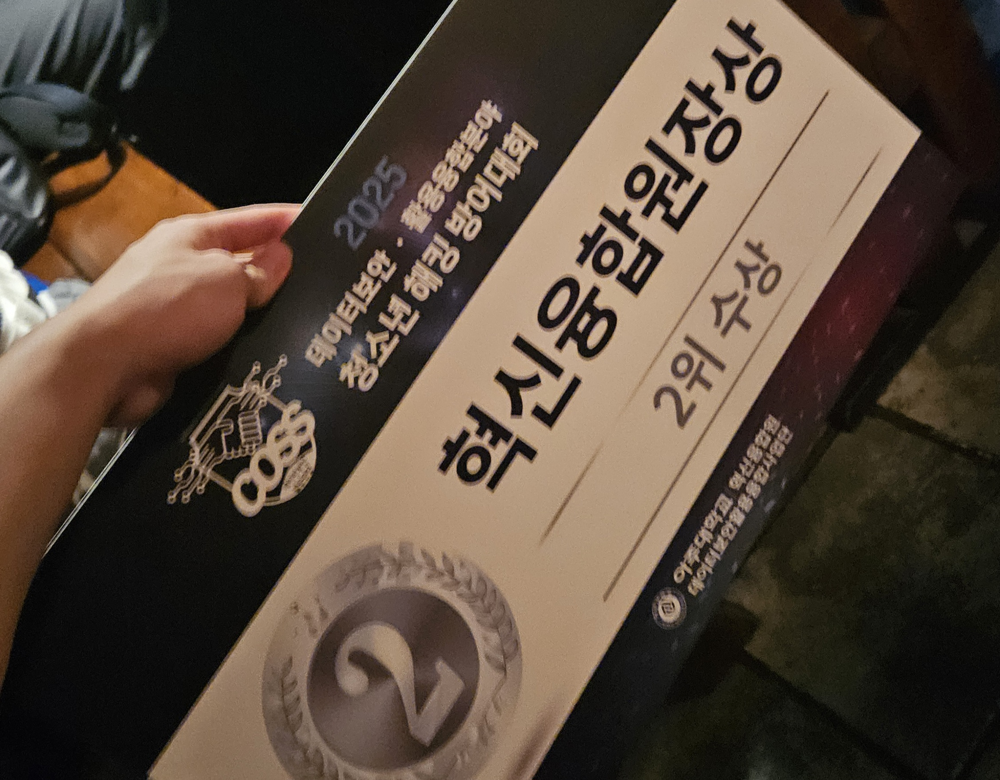

## COSS 2025 Final
---



아주대학교에서 주최한 2025 COSS 데이터보안 활용융합분야 청소년 해킹 방어대회에 참여했다. 예선과 본선 모두 리버싱 분야 문제가 쉽게 나왔는데 예선 때는 마지막 문제를 왜인지 못 풀었었으나 본선 때는 모두 풀이할 수 있어서 다행이었다. 본선 때도 마지막 문제를 푸는데 이상한 부분에서 시간을 많이 낭비했었기에 코드를 좀 더 잘 작성하도록 노력해야겠다.

## circuit game
---

```zsh title='prob.txt'
Y1 = NAND(n1,n2)
Y2 = n3 XOR n4
Y3 = NOT(n5 AND n6)
Y4 = Y1 AND n7
Y5 = Y2 OR Y3
Y6 = NOR(n8,n9)
Y7 = NOT(Y5 XOR n10)
Y8 = Y6 NAND Y4
Y9 = (n11 AND n12) OR n11
Y10 = Y7 AND NOT(Y9)
Y11 = NOT(n13 XOR n14)
Y12 = NAND(Y10,Y11)
Y13 = Y12 XOR n15
Y14 = Y8 NOR Y13
Y15 = NOR(n16,NAND(n1,n16))
Y16 = NOT(Y14 AND Y15)
```

문제 파일을 다운로드 받으면 위와 같은 텍스트 파일이 주어진다. 문제 설명에 존재하는 주소에 nc 접속하면 `n1` ~ `n16`의 값이 주어지고 `Y1` ~ `Y16`의 값을 입력받는데 이를 통해 `prob.txt`의 연산을 수행한 결과를 찾아야 한다는 것을 알 수 있다.

<br>

```python title='ex.py'
from pwn import *

def nand(a, b):
    return int(not (a and b))

def nor(a, b):
    return int(not (a or b))

p = remote('43.202.158.172', 12345)

n = [0 for _ in range(17)]
Y = [0 for _ in range(17)]

for i in range(1, 17):
    p.recvuntil(': ')
    n[i] = int(p.recvline()[:-1].decode())
    
Y[1] = nand(n[1], n[2])
Y[2] = n[3] ^ n[4]
Y[3] = int(not (n[5] & n[6]))
Y[4] = Y[1] & n[7]
Y[5] = Y[2] | Y[3]
Y[6] = nor(n[8], n[9])
Y[7] = int(not (Y[5] ^ n[10]))
Y[8] = nand(Y[6], Y[4])
Y[9] = (n[11] & n[12]) | n[11]
Y[10] = Y[7] & int(not Y[9])
Y[11] = int(not (n[13] ^ n[14]))
Y[12] = nand(Y[10], Y[11])
Y[13] = Y[12] ^ n[15]
Y[14] = nor(Y[8], Y[13])
Y[15] = nor(n[16], nand(n[1],n[16]))
Y[16] = int(not (Y[14] & Y[15]))

pay = ' '.join([str(i) for i in Y])

p.sendlineafter(b': ', pay)

p.interactive()
```
대회 시간이 짧았고 문제도 간단하기에 빠르게 파이썬 코드를 작성해서 풀이하였다.

## base
---

이 문제의 경우 팀원이 풀어줘서 대회 당시에는 풀지 않았었는데, 커스텀 암호화 분석 문제를 항상 잘 못 풀었었기에 대회가 끝난 후 AI를 활용하지 않고 스스로 풀어보았다.

<br>

```sh title='data.txt'
ABCDEFGHIJKLMNOPQRSTUVWXYZabcdefghijklmnopqrstuvwxyz0123456789+/ABCDEFGHIJKLMNOPQRSTUVWXYZabcdefghijklmnopqrstuvwxyz0123456789+/
```

```sh title='encode_data.txt'
fniu3dQC3Wcimkeojn75nttmng3QQBxXMQ4cX9DkNMNbUCBhUY0e192zGHiFxwQYxVc7SPr0oPoWDjXVTukyKWtJfW3t3kxqmn4KjdgTjgp3nBDnQQNHMtBUXMiPNCQ9NYc4U9e81M7aGwt+GV3gxbxlSHRzojqFDunYDF67A+v=
```

```sh title='encode_flag.txt'
N90cNVeJXHDBDP3/N9BsNt2WXMi8NHW=
```

문제 파일을 다운로드 받으면 위와 같은 3개의 파일이 주어진다. `data.txt` 파일과 `encode_data` 파일의 관계성을 파악해서 인코딩 방식을 알아낸 후 `encode_flag` 파일을 디코딩해야 한다. 

<br>

```sh title='encode_data.txt'
fniu3dQC3Wcimkeojn75nttmng3QQBxXMQ4cX9DkNMNbUCBhUY0e192zGHiFxwQYxVc7SPr0oPoWDjXVTukyKWtJfW3t3kxqmn4KjdgTjgp3nBDnQQNHMtBUXMiPNCQ9NYc4U9e81M7aGwt+GV3gxbxlSHRzojqFDunYDF67A+v=
```

`encode_data.txt` 파일을 보고, 문제 제목을 보고, 파일의 길이를 볼 때 커스텀 base64 방식이라는 것을 알 수 있다.

<br>


가장 기본적으로 위 base64 인코딩 테이블을 임의로 바꿨을 것이라고 유추할 수 있다. 우리는 `data.txt`가 있고 `encode_data.txt`가 있기 때문에 이 두 파일로 테이블을 구하고 그 테이블을 이용해서 `encode_flag.txt`를 복호화할 수 있다.

<br>



임의로 테스트 해볼 때 같은 값이면 같은 문자로 치환되는 것을 보아 추측이 맞았다는 것을 알 수 있다.

<br>

```python frame='code' title='ex.py'
with open('data.txt', 'r') as f:
    data = f.read()[:-1]
    
with open('encode_data.txt', 'r') as f:
    enc_data = f.read()[:-1]
    
with open('encode_flag.txt', 'r') as f:
    enc_flag = f.read()[:-1]

bin_data = ''.join([bin(ord(i))[2:].zfill(8) for i in data])
split_data =  [int(bin_data[i:i+6].ljust(6, '0'), 2) for i in range(0, len(bin_data), 6)]

sbox = [0 for _ in range(64)]
for i in range(len(split_data)):
    sbox[split_data[i]] = enc_data[i]

flag = ''
for i in range(len(enc_flag)):
    try:
        flag += bin(sbox.index((enc_flag[i])))[2:].zfill(6)
    except:
        flag += '000000'

print(''.join([chr(int(flag[i:i+8], 2)) for i in range(0, len(flag), 8)]))
```

분석을 마쳤기에 플래그를 구하는 파이썬 코드를 작성해서 풀이하였는데, 테이블이 몇 칸이 안 구해져서 플래그 중 2글자를 알 수가 없다. 다른 방법이 있는지는 모르겠지만 `flag{Base64@fi@d_table}`라는 구해진 불완전한 플래그를 보아 완전한 플래그를 유추할 수 있다.

## Save the Cat
---



놀랍게도 `prob.apk` 파일이 주어진다. 해당 apk 파일을 avd에 올리고 실행해보면 위 사진과 같은데 새끼 고양이 두 마리가 각각의 입력을 받는다.

<br>

```java frame='code' title='prob.java'
package com.example.android_prob1;

import androidx.core.location.LocationRequestCompat;
import java.util.Arrays;
import java.util.List;
import kotlin.Metadata;
import kotlin.collections.CollectionsKt;
import kotlin.jvm.internal.Intrinsics;

@Metadata(d1 = {"\u0000\u001a\n\u0002\u0018\u0002\n\u0002\u0010\u0000\n\u0002\b\u0003\n\u0002\u0010\u000b\n\u0000\n\u0002\u0010\u000e\n\u0002\b\u0002\bÇ\u0002\u0018\u00002\u00020\u0001B\t\b\u0002¢\u0006\u0004\b\u0002\u0010\u0003J\u0016\u0010\u0004\u001a\u00020\u00052\u0006\u0010\u0006\u001a\u00020\u00072\u0006\u0010\b\u001a\u00020\u0007¨\u0006\t"}, d2 = {"Lcom/example/android_prob1/Calculator;", "", "<init>", "()V", "verify", "", "var1", "", "var2", "app_debug"}, k = 1, mv = {2, 0, 0}, xi = 48)
/* compiled from: Calculator.kt */
public final class Calculator {
    public static final int $stable = 0;
    public static final Calculator INSTANCE = new Calculator();

    private Calculator() {
    }

    public final boolean verify(String var1, String var2) {
        Intrinsics.checkNotNullParameter(var1, "var1");
        Intrinsics.checkNotNullParameter(var2, "var2");
        int N = var1.length();
        if ((var2.length() != 16) || (N != 16)) {
            return false;
        }
        int i = N * 2;
        int[] iArr = new int[i];
        for (int i2 = 0; i2 < i; i2++) {
            iArr[i2] = 0;
        }
        for (int i3 = 0; i3 < N; i3++) {
            iArr[i3] = var1.charAt(i3);
            iArr[i3 + N] = var2.charAt(i3);
        }
        for (int i4 = 0; i4 < N; i4++) {
            iArr[i4] = ((iArr[i4] & 15) << 4) | (iArr[i4 + N] >> 4);
            iArr[i4 + N] = ((iArr[i4 + N] & 15) << 4) | (iArr[i4] >> 4);
        }
        List cat = CollectionsKt.listOf(99, 97, 116);
        int length = iArr.length;
        for (int i5 = 0; i5 < length; i5++) {
            iArr[i5] = iArr[i5] ^ ((Number) cat.get(i5 % 3)).intValue();
        }
        for (int i6 = 0; i6 < 4; i6++) {
            for (int j = 0; j < i6; j++) {
                int base = i6 * 4;
                int temp = iArr[base];
                iArr[base] = iArr[base + 1];
                iArr[base + 1] = iArr[base + 2];
                iArr[base + 2] = iArr[base + 3];
                iArr[base + 3] = temp;
            }
        }
        for (int i7 = 0; i7 < 4; i7++) {
            for (int j2 = 0; j2 < i7; j2++) {
                int temp2 = iArr[i7 + 0];
                iArr[i7 + 0] = iArr[i7 + 4];
                iArr[i7 + 4] = iArr[i7 + 8];
                iArr[i7 + 8] = iArr[i7 + 12];
                iArr[i7 + 12] = temp2;
            }
        }
        return Arrays.equals(new int[]{6, LocationRequestCompat.QUALITY_BALANCED_POWER_ACCURACY, 130, 179, 226, 146, 166, 20, 116, 112, 98, 210, 244, 166, 54, 0, 151, 66, 117, 7, 67, 36, 146, 51, 230, 87, 135, 85, 39, 50, 85, 182}, iArr);
    }
}
```

분석해보면 `var1`과 `var2`라는 이름으로 두 가지 문자열을 받는다. 두 문자열 모두 길이는 16이어야 하고 이 문자열들을 배열로 옮긴다. 이후 스왑, cat으로 xor 연산, 순서 바꾸기의 과정을 거친 후 마지막 배열과 비교한다. 검증 로직이 복잡하지 않기에 간단하게 파이썬 코드를 작성해서 풀이하면 된다.

<br>

```python frame='code' title='ex.py'
cat = [99, 97, 116]
ans = [6, 102, 130, 179, 226, 146, 166, 20, 116, 112, 98, 210, 244, 166, 54, 0, 151, 66, 117, 7, 67, 36, 146, 51, 230, 87, 135, 85, 39, 50, 85, 182]

for i in range(3, -1, -1):
    for j in range(i):
        ans[i + 0], ans[i + 4], ans[i + 8], ans[i + 12] = ans[i + 12], ans[i + 0], ans[i + 4], ans[i + 8]

for i in range(3, -1, -1):
    base = i * 4
    for j in range(i):
        ans[base], ans[base + 1], ans[base + 2], ans[base + 3] = ans[base + 3], ans[base], ans[base + 1], ans[base + 2]

for i in range(32):
    ans[i] ^= cat[i % 3]

for i in range(16):
    a = ans[i]
    b = ans[i + 16]
    ans[i] = ((a & 15) << 4) | (b >> 4)
    ans[i + 16] = ((b & 15) << 4) | (a >> 4)

print(''.join(map(chr, ans[16:] + ans[:16])))
```

역연산, 역연산, 역연산하면 플래그를 구하고 합치면 플래그를 구할 수 있다.

## Mad Sphinx
---

```c
int __fastcall main(int argc, const char **argv, const char **envp)
{
  char s[64]; // [rsp+0h] [rbp-40h] BYREF

  __isoc99_scanf(&unk_3004, s, envp);
  if ( strlen(s) == 16 )
  {
    func4(s);
    func0(s);
    func5(s);
    func9(s);
    func3(s);
    func7(s);
    func8(s);
    func6(s);
    func2(s);
    func1(s);
    if ( !memcmp(s, &compare, 0x10uLL) )
      printf("OK");
    else
      printf("KO");
    return 0;
  }
  else
  {
    printf("KO");
    return 0;
  }
}
```

예선 문제였던 `Angry Sphinx`가 조금 더 어렵게 나왔다. 먼저 auto rev 형태의 문제로 3분 내에 30 스테이지를 해결해야 한다. 한 문제는 길이가 16인 문자열을 입력받고 `func*`함수들을 통해 연산한 후 임의의 배열과 비교하여 검증한다. 각 `func*` 함수들은 무작위로 로직을 3가지씩 가지고 있는데 이는 `임의의 수로 ROR`, `임의의 수로 ROL`, `1칸씩 SHL`, `1칸씩 SHR`, `임의의 수로 XOR`, `sbox로 치환`, `f* 함수의 리턴값으로 XOR`이었다. 나머지 과정은 모두 예선과 같거나 비슷한 방식을 풀이하면 되었으나 어려움은 `f*`에 있었다. 함수의 이름도 0~255의 랜덤한 정수였을 뿐만 아니라 리턴값을 결정하는 과정이 일반화시키기 어려웠기 때문이었다.

<br>

```sh frame='terminal' title='gdb'
────────────────────────────────────[ BACKTRACE ]─────────────────────────────────────
 ► 0   0x555555555f74 main+4
   1   0x7ffff7c2a1ca __libc_start_call_main+122
   2   0x7ffff7c2a28b __libc_start_main+139
   3   0x5555555550a1 _start+33
──────────────────────────────────────────────────────────────────────────────────────
pwndbg> call (unsigned char)f192()
$1 = 230 '\346'
```

나는 해당 문제를 `gdb`를 활용하여 풀이하였다. `call` 명령어를 통해 원하는 함수의 리턴값을 구할 수 있었고 어차피 xor 연산은 각 글자당, 즉 1Byte씩만 이루어질 것이기에 `(unsigned char)`로 타입을 캐스팅하여 값을 구할 수 있었다. 이 과정을 파이썬 코드에 포함시켜 굳이 일반화시키 않고도 값을 구할 수 있었다.

<br>

```py frame='code' title='ex.py'
from pwn import *
from capstone import *
import base64 as b64
import os
import subprocess, re, sys

def call_uchar(func_name):
    try:
        out = subprocess.check_output(
            [
                "gdb", "-q", "--batch", "-nx",
                "-ex", f"file ./prob",
                "-ex", "start",
                "-ex", f"call (unsigned char) {func_name}()"
            ],
            text=True
        )
    except subprocess.CalledProcessError as e:
        sys.exit(f"[gdb 오류] {e.stderr or e.output}")

    m = re.search(r"=\s*([0-9]+)", out)
    if not m:
        sys.exit(f"[파싱 실패] gdb 출력: {out!r}")
    return int(m.group(1))

p = remote('3.36.16.178', 14443)

for cast in range(30):
    p.recvuntil(b'Binary: \n')

    with open('./prob', 'wb') as f:
        f.write(b64.b64decode(p.recvline()[:-1].decode()))
        
    os.chmod('./prob', 0o755)

    e = ELF('./prob')
    md = Cs(CS_ARCH_X86, CS_MODE_64)

    # func0 ~ func9의 주소 찾기
    funcs = []
    for i in range(10):
        f_name = 'func' + str(i)
        funcs.append(e.symbols[f_name])

    ror_addr = e.symbols['ror']
    rol_addr = e.symbols['rol']

    # sbox 값 찾기
    sbox = list(e.read(e.symbols['sbox'], 256))

    # f* 함수들이의 주소 찾기
    fs = {}
    for i in range(256):
        try:
            f_name = 'f' + str(i)
            fs[e.symbols[f_name]] = f_name
        except:
            continue
    
    # 비교 배열 찾기
    ans = list(e.read(e.symbols['compare'], 16))

    # main
    main_addr = e.symbols['main']
    main_size = e.functions['main'].size
    main_code = e.read(main_addr, main_size)

    # 함수 순서 파싱
    c_funcs = []
    for i in md.disasm(main_code, main_addr):
        # print(f"0x{i.address:x}:\t{i.mnemonic}\t{i.op_str}")
        if i.mnemonic == 'call':
            c_funcs.append(int(i.op_str, 16))
    c_funcs = c_funcs[3:-3]
    c_funcs = c_funcs[::-1]

    # 역연산 함수 선언
    def xor_with(addr):
        v = call_uchar(fs[addr])
        for i in range(16):
            ans[i] ^= v
        
    def shr():
        ans.insert(0, ans.pop())
        
    def shl():
        ans.append(ans.pop(0))

    def sb():
        for i in range(16):
            ans[i] = sbox.index(ans[i])

    def rol(val, r_bits):
        return ((val << r_bits) | (val >> (8 - r_bits))) & ((1 << 8) - 1)

    def ror(val, r_bits):
        return ((val >> r_bits) | (val << (8 - r_bits))) & ((1 << 8) - 1)

    def rrol(b):
        for i in range(16):
            ans[i] = rol(ans[i], b)
            
    def rror(b):
        for i in range(16):
            ans[i] = ror(ans[i], b)

    def xor(v):
        for i in range(16):
            ans[i] ^= v

    # 역연산
    for i in range(10):
        f_addr = e.symbols[f'func{funcs.index(c_funcs[i])}']
        f_size = e.functions[f'func{funcs.index(c_funcs[i])}'].size
        f_code = e.read(f_addr, f_size)
        
        fff = []
        print('라운드:', i)
        for j in md.disasm(f_code, f_addr):
            # print(f"0x{j.address:x}:\t{j.mnemonic}\t{j.op_str}")
            if j.mnemonic == 'xor' and j.op_str == 'ebx, ecx':
                fff.append([xor_with, xor_addr])
                continue
            if j.mnemonic == 'call':
                xor_addr = int(j.op_str, 16)
            if j.mnemonic == 'xor':
                fff.append([xor, int(j.op_str[5:], 16) & 0xff])
                continue
            if j.mnemonic == 'cmp' and j.op_str[-1:] == 'e':
                fff.append([shr])
                continue
            if j.mnemonic == 'cmp' and j.op_str[-1:] == '0':
                fff.append([shl])
                continue
            if j.mnemonic == 'call' and j.op_str == hex(ror_addr):
                fff.append([rrol, ro_value])
                continue
            if j.mnemonic == 'call' and j.op_str == hex(rol_addr):
                fff.append([rror, ro_value])
                continue
            if j.mnemonic == 'mov' and j.op_str[:3] == 'esi':
                ro_value = int(j.op_str[-1:])
                continue
            if j.mnemonic == 'lea' and j.op_str[:3] == 'rcx':
                fff.append([sb])
                continue
        fff = fff[::-1]
        for i in range(3):
            if len(fff[i]) == 2:
                fff[i][0](fff[i][1])
            else:
                fff[i][0]()

    # 페이로드
    inp = ''.join([chr(c) for c in ans])
    print(inp)
    p.sendlineafter(b'Input: ', inp)

p.interactive()
```

최종 풀이 코드는 위와 같다. 파이썬 스크립트에 `gdb`를 활용해보는 것은 처음이었기에 AI의 도움을 받아 해결하였다. 아래는 함수들의 주소를 구하고 일반화시킨 로직에 따라 역연산하고 페이로드를 보내는 과정을 30번 반복하도록 한 코드인데 굉장히 일관성 없으며 가독성이 떨어지고 비효율적이라는 것을 알 수 있다. 이러한 코드 때문에 풀이에 계속 어려움을 느꼈기에 다음에는 조금 더 최대한 코드를 바르게 작성하여 풀이하는 과정이 필요할 것이라고 느꼈다. 아무튼 위의 코드를 실행하여 총 30번의 스테이지를 클리어하고 플래그를 구할 수 있었다.

## Comment
---



대회 운영이 굉장히 원활했으며 점심 도시락이 상당히 맛있었고, 마지막에 받은 선물 또한 COSS 로고가 박혀있어 기념적이었다. 팀원들 덕분에 2위 수상이라는 좋은 결과까지 볼 수 있었던 대회였다.