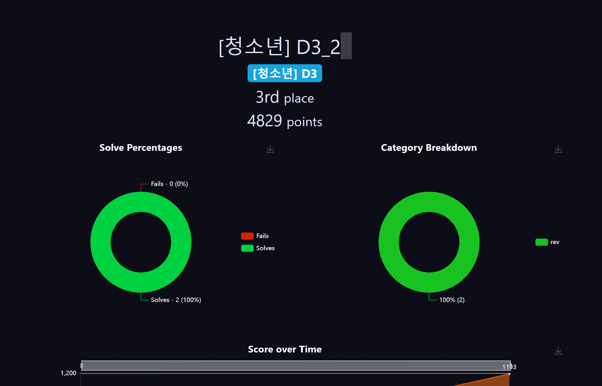

## CCE 2025 Quals
---



CCE 2025 예선에 참가했다. CCE는 처음으로 나갔던 4인 팀 대회였고 작년에는 리버싱 **0솔**을 기록하며 예선 탈락했었다. 정말 예선 중에 이런 일 저런 일 많이 있었고 나름대로 의미가 있는 대회였는데 올 해 다시 나와 예선에서 좋은 기록 보이며 본선에 진출하게 되어 다행이라는 생각이 든다.

리버싱이 총 5문제 출제되었는데 그 중 2문제는 팀원이 풀이하여 대회가 종료된 후 다시 풀어보았고 나는 다른 2문제를 풀이하였다. 한 문제는 끝날 때까지 0솔이었는데 일반/공공부에 올라온 라업을 보면서 신기하여 업솔빙?해보았다.
(라업 작성 순서는 많이 풀린 순이다.)

## zigzag
---

```zsh
╭─tuplest@BOOK-8JHQNP0CQB ~/Hack/ctf/cce2025/zigzag
╰─$ file prob
prob: ELF 64-bit LSB executable, x86-64, version 1 (SYSV), statically linked, BuildID[sha1]=192684e400648c342c78c7f36ea5a838dc1aefd3, for GNU/Linux 3.2.0, stripped
```

문제 파일을 다운로드 받으면 하나의 `prob`라는 바이너리가 주어진다. 해당 바이너리를 ida를 통해 열어보면 로딩 중부터 상당히 쎄한 느낌이 드는데, 함수 리스트를 보고 바로 알 수 있듯이 `statically linked` 바이너리이다.

실제로 바이너리를 실행시켜보면 문자열을 하나 입력받고 `Fail..`을 출력한다. 우선 분석해야 할 부분을 찾기 위해 해당 문자열을 ida에서 검색해주었고 xrefs 기능을 통해 문자열을 사용하는 함수를 찾아갔다.

```c frame='code' title='sub_404F20'
__int64 sub_404F20()
{
  __int64 v0; // rax
  __int64 v1; // rdx
  __int64 v2; // rcx
  __int64 v3; // r8
  __int64 v4; // r9
  char v5; // al
  __int64 v6; // rax
  __int64 v8; // [rsp+0h] [rbp-48h] BYREF
  _BYTE v9[24]; // [rsp+10h] [rbp-38h] BYREF
  unsigned __int64 v10; // [rsp+28h] [rbp-20h]

  v10 = __readfsqword(0x28u);
  v0 = sub_477980(&unk_5C7BC0, "Input: ");
  sub_4767C0(v0);
  v9[0] = 0;
  v5 = ((__int64 (__fastcall *)(_QWORD, __int64, __int64, __int64, __int64, __int64, _BYTE *, _QWORD))sub_405690)(
         *(__int64 *)((char *)&qword_5C7CE0[30] + *(_QWORD *)(qword_5C7CE0[0] - 24)),
         10LL,
         v1,
         v2,
         v3,
         v4,
         v9,
         0LL);
  sub_4074F0(qword_5C7CE0, &v8, (unsigned int)v5);
  if ( (unsigned __int8)sub_405730(&v8) )
    v6 = sub_477980(&unk_5C7BC0, "Good~");
  else
    v6 = sub_477980(&unk_5C7BC0, "Fail..");
  sub_4056F0(v6);
  sub_47E470(&v8);
  if ( v10 != __readfsqword(0x28u) )
    sub_526F70();
  return 0LL;
}
```

`sub_405730(&v8)` 함수를 통해 조건을 판단한 후 `Good~` 또는 `Fail..`을 출력하는 것을 볼 수 있다.

```c++ frame='code' title='sub_405730'
__int64 __fastcall sub_405730(_QWORD *a1)
{
  __int64 result; // rax
  __int64 v2; // rdx
  int v3; // ecx
  int v4; // esi
  int v5; // eax

  result = 0LL;
  if ( a1[1] == 73LL )
  {
    v2 = 0LL;
    v3 = 1;
    v4 = 0;
    while ( 1 )
    {
      if ( byte_56CDC0[v2] != ((unsigned __int8)(v4 + v3) ^ __ROL1__(*(_BYTE *)(*a1 + v2), 4)) )
        return 0LL;
      ++v2;
      v5 = v4 + v3;
      v4 = v3;
      if ( v2 == 73 )
        break;
      v3 = v5;
    }
    return 1LL;
  }
  return result;
}
```

해당 함수를 보면 아주 간단한 xor 및 rol 연산을 통해 배열을 비교하고 있는 것을 볼 수 있고 따라서 위 코드를 역연산하는 파이썬 스크립트를 작성하여 플래그를 구할 수 있었다.

```python frame='code' title='ex.py'
def ror(n, c):
    return ((n >> c) | (n << (8 - c))) & 0xff

ans = list(bytes.fromhex('37 34 55 26 0B 2E 46 95 24 1F C3 AF 5F 31 ED 1B 0E 56 5B A4 39 C2 13 37 B2 51 E0 B6 6B BE 63 C4 81 AF D3 6A 3A F4 C8 2E BB D6 BE B1 0C 87 73 07 57 D1 B5 46 6B CB A3 84 E4 2A 53 1F FA A1 FD 8E 2B F6 3E 04 1C 92 63 77 46'))

v3 = 1
v4 = 0
for i in range(len(ans)):
    ans[i] = ror(ans[i] ^ (v4 + v3), 4)
    v5 = (v4 + v3) & 0xff
    v4 = v3
    v3 = v5

print(''.join([chr(c) for c in ans]))
```

익스 코드는 위와 같다.

:::note[FLAG]
cce2025{1d5dr5crq0cfq33r819046vbfv611e0487635f3rc5e22fer718q24t1707t940t}
:::


## Magic Encryptor
---

```sh title='output.txt'
magic = [5787271386232140802415848037357292200492083882111971000129760788311089175930299376289161215874474715799351454070878582251687914775680761456101625297456892, 5387606674726816082872610132875782527981170957076072680923994077089077976064392652252370277732171159642334409737331562019904590620888542541827717485113752, 8626813144153450863326526978937642827960900471127853257361958103243078281538385888983439090031905533720665350648755896855476802807423703305517452660147355, 1872979443975227995935637296750387505645616831379674309114728836574395312482706795529036206552423055700987377954505652312366332939354723406001342424122358, 4931753853283648195589701767102112310944252190842102303652590403853615847306776280311251936851699971378590087509438123963034451272804781439556584435505901]
N = 109074475661513195386347529878847653525066013979447623634672837526534779342254426211196990092087543057592914253366967405036738772402899175058372181938780141827862196403530817367346609634886009660373504705163832963810537444261419237976851935668770550613169673224960460503911295178003058365136612663341299983313
e = 65537
c = 17105155785407276085345997971088333947167848217427002799040362954041554640183792147706711255009531752373034539830942249185707384204560028872976040858835969379984356330875515755060870292949684300727962830885860251054647362624239983610820847460636592878264757476971385962718588508475554159060207702430258180509
```

문제 파일을 다운로드 받고 실행해보면 main 함수의 인자로 문자열을 입력받는 것을 알 수 있고, 이를 통해 입력값을 주어 실행하면 `magic`, `N`, `e`, `c` 값을 주는 것을 볼 수 있다. 이는 `output.txt`의 내용과 겹치므로 따라서 `output.txt`와 정확하게 같은 결과를 출력하도록 하는 입력값을 찾는 게 목표라는 것을 알 수 있다.

```c frame='code' title='encryptor::main::haeb8d0ed9182104f'
__int64 encryptor::main::haeb8d0ed9182104f()
{
  v91[0] = _$LT$rand..rngs..thread..ThreadRng$u20$as$u20$core..default..Default$GT$::default::h7b49ce56397ec9d7();
  _$LT$R$u20$as$u20$num_bigint..bigrand..RandBigInt$GT$::gen_biguint::h858291b3c6fc1e81(&v72, v91, 510LL);
  _$LT$R$u20$as$u20$num_bigint..bigrand..RandBigInt$GT$::gen_biguint::h858291b3c6fc1e81(&v74, v91, 510LL);
  encryptor::generate_prime_512::h1663e5a4bad40f94(&v70);
  _$LT$R$u20$as$u20$num_bigint..bigrand..RandBigInt$GT$::gen_biguint::h858291b3c6fc1e81(&v76, v91, 512LL);
  v81 = v73;
  v80 = v72;
  v82 = v74;
  v83 = v75;
  *(_OWORD *)src = v70;
  v85 = v71;
  *(_OWORD *)v86 = v76;
  v87 = v77;
  if ( (*(_QWORD *)v91[0])-- == 1LL )
    alloc::rc::Rc$LT$T$C$A$GT$::drop_slow::h1ef448498e8fb831(v91);
  encryptor::generate_prime_512::h1663e5a4bad40f94(&v74);
  v92 = *((_QWORD *)&v74 + 1);
  num_bigint::biguint::multiplication::_$LT$impl$u20$core..ops..arith..Mul$u20$for$u20$$RF$num_bigint..biguint..BigUint$GT$::mul::h94bf2cadf3dad559(
    &v70,
    src[1],
    v85,
    *((_QWORD *)&v74 + 1),
    v75);
  v76 = xmmword_58580;
  v77 = 0LL;
  alloc::raw_vec::RawVec$LT$T$C$A$GT$::grow_one::h502fdabadf6c5962(&v76, &off_6A0A0);
  v102 = v3;
  **((_QWORD **)&v76 + 1) = 65537LL;
  v88 = (char *)*((_QWORD *)&v76 + 1);
  v5 = v76;
  v89 = (char *)*((_QWORD *)&v70 + 1);
  v79 = v70;
  v6 = 8LL * (_QWORD)v85;
  v7 = 0LL;
  v90 = v85;
  if ( (unsigned __int64)v85 >> 61 || v6 > 0x7FFFFFFFFFFFFFF8LL )
    goto LABEL_131;
  v8 = src[1];
  v9 = 8LL;
  
  // 중략 ..

LABEL_35:
  v99 = v14;
  v100 = v9;
  v101 = v13;
  encryptor::mod_pow::h9c1041ad57c990ee(v91, &v99, &v94, &v97);
  *(_QWORD *)&v72 = 0LL;
  *((_QWORD *)&v72 + 1) = 8LL;
  v73 = 0LL;
  num_bigint::biguint::multiplication::_$LT$impl$u20$core..ops..arith..Mul$u20$for$u20$$RF$num_bigint..biguint..BigUint$GT$::mul::h94bf2cadf3dad559(
    &v76,
    *((_QWORD *)&v82 + 1),
    v83,
    v86[1],
    v87);
  num_bigint::biguint::addition::_$LT$impl$u20$core..ops..arith..Add$LT$$RF$num_bigint..biguint..BigUint$GT$$u20$for$u20$num_bigint..biguint..BigUint$GT$::add::h5bbe3719d8a90a0f(
    &v70,
    &v76,
    &v80);
  num_bigint::biguint::division::_$LT$impl$u20$core..ops..arith..Rem$u20$for$u20$$RF$num_bigint..biguint..BigUint$GT$::rem::h676af4134814ba80(
    &v74,
    &v70,
    src);
    
    // 후략 ..
}
```

바이너리를 ida를 통해 열면 600줄 상당의 복잡한 코드를 볼 수 있고, 그 중 중요한 부분만 보면 위와 같다. 512 비트의 소수를 생성하고 공개 지수 `e = 65537`을 지정하여 입력값으로 RSA 암호문을 계산한다. 이후 랜덤한 값들을 뽑고 모듈러 p에서의 선형합동형을 5번 돌려서 `magic` 값을 생성해낸다.

이 때 모듈러가 p인 LCG의 연속 출력 5개를 알고 있으므로 모듈러를 복구할 수 있고 이를 바탕으로 복호화할 수 있다.

```python frame='code' title='ex.py'
from math import gcd

xs = [5787271386232140802415848037357292200492083882111971000129760788311089175930299376289161215874474715799351454070878582251687914775680761456101625297456892, 5387606674726816082872610132875782527981170957076072680923994077089077976064392652252370277732171159642334409737331562019904590620888542541827717485113752, 8626813144153450863326526978937642827960900471127853257361958103243078281538385888983439090031905533720665350648755896855476802807423703305517452660147355, 1872979443975227995935637296750387505645616831379674309114728836574395312482706795529036206552423055700987377954505652312366332939354723406001342424122358, 4931753853283648195589701767102112310944252190842102303652590403853615847306776280311251936851699971378590087509438123963034451272804781439556584435505901]
n = int("109074475661513195386347529878847653525066013979447623634672837526534779342254426211196990092087543057592914253366967405036738772402899175058372181938780141827862196403530817367346609634886009660373504705163832963810537444261419237976851935668770550613169673224960460503911295178003058365136612663341299983313", 10)
e = 65537 
c = int("17105155785407276085345997971088333947167848217427002799040362954041554640183792147706711255009531752373034539830942249185707384204560028872976040858835969379984356330875515755060870292949684300727962830885860251054647362624239983610820847460636592878264757476971385962718588508475554159060207702430258180509", 10)

def egcd(a, b):
    if b == 0: return (a, 1, 0)
    g, x, y = egcd(b, a % b)
    return (g, y, x - (a // b) * y)

def modinv(a, m):
    g, x, _ = egcd(a % m, m)
    if g != 1:
        raise ValueError("no inverse")
    return x % m

d = [xs[i+1] - xs[i] for i in range(len(xs)-1)]
Z = []
for i in range(len(d)-2):
    Z.append(abs(d[i+2]*d[i] - d[i+1]*d[i+1]))

g = 0
for z in Z:
    g = gcd(g, z)

p = gcd(g, n)
if p == 1 or p == n:
    raise SystemExit("p 복구 실패: 더 많은 출력이 필요하거나 노이즈가 섞였을 수 있음")

q = n // p

phi = (p - 1) * (q - 1)
dkey = modinv(e, phi)
m = pow(c, dkey, n)

blen = (m.bit_length() + 7) // 8
pt_bytes = m.to_bytes(blen, "big")

print("p:", p)
print("q:", q)
print("plaintext bytes:", pt_bytes)
try:
    print("plaintext utf-8:", pt_bytes.decode("utf-8"))
except UnicodeDecodeError:
    print("plaintext (latin-1):", pt_bytes.decode("latin-1"))
```

위와 같은 코드를 통해 플래그를 구할 수 있었다. (암호학에 대해서는 꽝이기에 AI의 도움을 절실히 받았다.)

:::note[FLAG]
cce2025{d6234bbdc2bc77dcdc7800cf01854c2fd5e8de03069da0a99cddd8860bf89f0c}
:::

## Double Encryptor
---

```sh title='output.txt'
21517927fe130833b4397f95854cb89681df1771b96726437163a9323e7b47f4fedf4355b2f17aa18ed0573f1ee7264302b6891a76565394e3a214f3c3d404ede3f11fb85f1e60c09fef50792c4efd99
```

`encryptor`의 바이너리 하나와 `output.txt`가 주어진다. 또 다시 바이너리를 ida를 통해 열어보면 상당한 길이의 암호화 로직을 볼 수 있다. 결론부터 말하면 `RC4 암호화` -> `PKCS#7 패딩` -> `AES ECB 암호화`이다.

```c frame='code' title='sub_8EF0'
do
{
    v3 = *((_BYTE *)&v163 + v0 + 7);
    v4 = (unsigned __int8)(byte_472C0[((_BYTE)v0 - 1) & 0xE] + v3 + v2);
    *((_BYTE *)&v163 + v0 + 7) = *((_BYTE *)&v164 + v4);
    *((_BYTE *)&v164 + v4) = v3;
    v5 = *((_BYTE *)&v164 + v0);
    v2 = byte_472C0[v0 & 0xF] + v5 + v4;
    *((_BYTE *)&v164 + v0) = *((_BYTE *)&v164 + v2);
    *((_BYTE *)&v164 + v2) = v5;
    v0 += 2LL;
}
```

가령 윗 부분의 코드를 보면 `RC4` 알고리즘의 `KSA`와 닮아있는 것을 볼 수 있다.

```sh title='S-Box'
.rodata:0000000000047728 ; unsigned __int8 byte_47728[256]
.rodata:0000000000047728 byte_47728      db 63h, 7Ch, 77h, 7Bh, 0F2h, 6Bh, 6Fh, 0C5h, 30h, 1, 67h
.rodata:0000000000047728                                         ; DATA XREF: sub_8EF0+55D↑o
.rodata:0000000000047728                                         ; sub_8EF0+5AF↑o ...
.rodata:0000000000047733                 db 2Bh, 0FEh, 0D7h, 0ABh, 76h, 0CAh, 82h, 0C9h, 7Dh, 0FAh
.rodata:000000000004773D                 db 59h, 47h, 0F0h, 0ADh, 0D4h, 0A2h, 0AFh, 9Ch, 0A4h, 72h
.rodata:0000000000047747                 db 0C0h, 0B7h, 0FDh, 93h, 26h, 36h, 3Fh, 0F7h, 0CCh, 34h
.rodata:0000000000047751                 db 0A5h, 0E5h, 0F1h, 71h, 0D8h, 31h, 15h, 4, 0C7h, 23h
.rodata:000000000004775B                 db 0C3h, 18h, 96h, 5, 9Ah, 7, 12h, 80h, 0E2h, 0EBh, 27h
.rodata:0000000000047766                 db 0B2h, 75h, 9, 83h, 2Ch, 1Ah, 1Bh, 6Eh, 5Ah, 0A0h, 52h
.rodata:0000000000047771                 db 3Bh, 0D6h, 0B3h, 29h, 0E3h, 2Fh, 84h, 53h, 0D1h, 0
.rodata:000000000004777B                 db 0EDh, 20h, 0FCh, 0B1h, 5Bh, 6Ah, 0CBh, 0BEh, 39h, 4Ah
.rodata:0000000000047785                 db 4Ch, 58h, 0CFh, 0D0h, 0EFh, 0AAh, 0FBh, 43h, 4Dh, 33h
.rodata:000000000004778F                 db 85h, 45h, 0F9h, 2, 7Fh, 50h, 3Ch, 9Fh, 0A8h, 51h, 0A3h
.rodata:000000000004779A                 db 40h, 8Fh, 92h, 9Dh, 38h, 0F5h, 0BCh, 0B6h, 0DAh, 21h
.rodata:00000000000477A4                 db 10h, 0FFh, 0F3h, 0D2h, 0CDh, 0Ch, 13h, 0ECh, 5Fh, 97h
.rodata:00000000000477AE                 db 44h, 17h, 0C4h, 0A7h, 7Eh, 3Dh, 64h, 5Dh, 19h, 73h
.rodata:00000000000477B8                 db 60h, 81h, 4Fh, 0DCh, 22h, 2Ah, 90h, 88h, 46h, 0EEh
.rodata:00000000000477C2                 db 0B8h, 14h, 0DEh, 5Eh, 0Bh, 0DBh, 0E0h, 32h, 3Ah, 0Ah
.rodata:00000000000477CC                 db 49h, 6, 24h, 5Ch, 0C2h, 0D3h, 0ACh, 62h, 91h, 95h, 0E4h
.rodata:00000000000477D7                 db 79h, 0E7h, 0C8h, 37h, 6Dh, 8Dh, 0D5h, 4Eh, 0A9h, 6Ch
.rodata:00000000000477E1                 db 56h, 0F4h, 0EAh, 65h, 7Ah, 0AEh, 8, 0BAh, 78h, 25h
.rodata:00000000000477EB                 db 2Eh, 1Ch, 0A6h, 0B4h, 0C6h, 0E8h, 0DDh, 74h, 1Fh, 4Bh
.rodata:00000000000477F5                 db 0BDh, 8Bh, 8Ah, 70h, 3Eh, 0B5h, 66h, 48h, 3, 0F6h, 0Eh
.rodata:0000000000047800                 db 61h, 35h, 57h, 0B9h, 86h, 0C1h, 1Dh, 9Eh, 0E1h, 0F8h
.rodata:000000000004780A                 db 98h, 11h, 69h, 0D9h, 8Eh, 94h, 9Bh, 1Eh, 87h, 0E9h
.rodata:0000000000047814                 db 0CEh, 55h, 28h, 0DFh, 8Ch, 0A1h, 89h, 0Dh, 0BFh, 0E6h
.rodata:000000000004781E                 db 42h, 68h, 41h, 99h, 2Dh, 0Fh, 0B0h, 54h, 0BBh, 16h
```

이 밖에도 `AES`에서 사용되는 `S-Box`와 정확히 일치하는 상수가 존재하는 것을 볼 수 있다.

이러한 분석을 통해 두 번의 암호화 알고리즘을 분석했으므로 `.rodata` 영역에 존재하는 키 값을 가져와 그대로 역연산하여 플래그를 구할 수 있다.

```python frame='code' title='ex.py'
from Crypto.Cipher import AES

hex_string = "21517927fe130833b4397f95854cb89681df1771b96726437163a9323e7b47f4fedf4355b2f17aa18ed0573f1ee7264302b6891a76565394e3a214f3c3d404ede3f11fb85f1e60c09fef50792c4efd99"

rc4_key = bytes([
    0x8F, 0x1B, 0xC3, 0x47, 0xD2, 0x9A, 0x6E, 0x55,
    0x0F, 0xA8, 0x34, 0x21, 0x7C, 0xE9, 0x12, 0xBD,
])

k1 = bytes.fromhex("3C4FCF098815F7ABA6D2AE2816157E2B")[::-1]
k2 = bytes.fromhex("4FCF098815F7ABA6D2AE2816157E2E76")[::-1]
aes_key = k1 + k2

def pkcs7_unpad(data, block_size = 16):
    if not data or len(data) % block_size != 0:
        raise ValueError("Invalid PKCS#7 input length")
    pad = data[-1]
    if pad < 1 or pad > block_size or data[-pad:] != bytes([pad]) * pad:
        raise ValueError("Invalid PKCS#7 padding")
    return data[:-pad]

def rc4_crypt(key, data):
    S = list(range(256))
    j = 0
    for i in range(256):
        j = (j + S[i] + key[i % len(key)]) % 256
        S[i], S[j] = S[j], S[i]
    i = j = 0
    out = bytearray()
    for b in data:
        i = (i + 1) % 256
        j = (j + S[i]) % 256
        S[i], S[j] = S[j], S[i]
        K = S[(S[i] + S[j]) % 256]
        out.append(b ^ K)
    return bytes(out)

ciphertext = bytes.fromhex(hex_string)

aes = AES.new(aes_key, AES.MODE_ECB)
stage1 = aes.decrypt(ciphertext)

stage2 = pkcs7_unpad(stage1, 16)

plaintext = rc4_crypt(rc4_key, stage2)

print(plaintext.decode())
```

위 파이썬 역연산 코드를 통해 플래그를 구할 수 있다.

:::note[FLAG]
cce2025{288cef3743f98fa01115ba808719e86a7abff0ff446f7862e064c78cba23e228}
:::

## Brood
---

```c frame='code' title='
__int64 sub_6048()
{
  // 생략
  s2 = xmmword_3F000;
  v51 = xmmword_3F010;
  if ( v42 == 32 && !bcmp(v41, &s2, 0x20uLL) )
  {
    v57[0] = &off_4AAE0;
    v57[1] = 1LL;
    v57[2] = 8LL;
    *&v57[3] = 0LL;
    sub_3DF70(v57);
  }
  sub_A570(v58, v41);
  sub_A570(v54, v48);
  free(ptr);
  return sub_A570(v61, v62);
}
```

`correct` 문자열을 찾아 분석할 코드를 찾아오면 위와 같은 함수 `sub_6048`을 볼 수 있다. 위 코드는 `sub_6048`의 가장 아래 로직인데 `s2`와 `v51`(연속된 메모리이다)에 어떤 데이터들을 불러오고 `v41`과 비교하여 같은지 검증한다. `v42`가 32인지도 검증하는데 `off_4AAE0`이 `correct` 문자열인 것을 보아 `v41`이 입력값이 암호화된 것, `v42`가 길이인 것을 알 수 있다.

```c frame='code' title='sub_6048'
v36 = sub_5B00(&v61, _byteswap_ulong(*v33), _byteswap_ulong((*(v33 + 6) << 16) | *(v33 + 4) | (*(v33 + 5) << 8)));
v38 = sub_5B00(&v61, v36, v37);
```

다른 부분 생략하고 암호화를 직접적으로 하는 함수를 찾으면 위 두 줄로 함수 `sub_5B00`으로 암호화를 진행한다.

```c frame='code' title='sub_5B00'
__int64 __fastcall sub_5B00(VM *a1, int a2, int a3)
{
  _QWORD *v3; // rax
  _QWORD *v4; // r14
  unsigned __int64 v5; // rax

  a1->left = a2;
  a1->right = a3;
  a1->IDX = 0;
  *&a1->PC = 0LL;
  v3 = malloc(0x2C8uLL);
  if ( !v3 )
    sub_410A(8LL, 712LL);
  v4 = v3;
  *v3 = sub_5EB2;
  v3[1] = sub_5EEC;
  v3[2] = sub_5F9B;
  v3[3] = sub_5F00;
  v3[4] = sub_5FEB;
  v3[5] = sub_5FC3;
  v3[6] = sub_5F9B;
  v3[7] = sub_5E9A;
  v3[8] = sub_5F28;
  v3[9] = sub_5F14;
  v3[10] = sub_5E82;
  v3[11] = sub_5F28;
  v3[12] = sub_5FFF;
  v3[13] = sub_5E68;
  v3[14] = sub_5F28;
  v3[15] = sub_5FEB;
  v3[16] = sub_5E51;
  v3[17] = sub_5F28;
  v3[18] = sub_5FFF;
  v3[19] = sub_5FAF;
  v3[20] = sub_5EEC;
  v3[21] = sub_5FEB;
  v3[22] = sub_5FD7;
  v3[23] = sub_5FAF;
  v3[24] = sub_5EEC;
  v3[25] = sub_5F9B;
  v3[26] = sub_5F00;
  v3[27] = sub_5FFF;
  v3[28] = sub_5FAF;
  v3[29] = sub_5EEC;
  v3[30] = sub_5FEB;
  v3[31] = sub_5F14;
  v3[32] = sub_6013;
  v3[33] = sub_5FAF;
  v3[34] = sub_5EEC;
  v3[35] = sub_5FEB;
  v3[36] = sub_5F9B;
  v3[37] = sub_5EEC;
  v3[38] = sub_602D;
  v3[39] = sub_5FAF;
  v3[40] = sub_5EEC;
  v3[41] = sub_5FEB;
  v3[42] = sub_5F9B;
  v3[43] = sub_5FAF;
  v3[44] = sub_5F00;
  v3[45] = sub_5F9B;
  v3[46] = sub_5EEC;
  v3[47] = sub_5FC3;
  v3[48] = sub_5F14;
  v3[49] = sub_5FD7;
  v3[50] = sub_5F7C;
  v3[51] = sub_5FAF;
  v3[52] = sub_5F00;
  v3[53] = sub_5F9B;
  v3[54] = sub_5EEC;
  v3[55] = sub_5FC3;
  v3[56] = sub_5F14;
  v3[57] = sub_5FD7;
  v3[58] = sub_5EEC;
  v3[59] = sub_5F9B;
  v3[60] = sub_5F00;
  v3[61] = sub_5FFF;
  v3[62] = sub_5FAF;
  v3[63] = sub_5EEC;
  v3[64] = sub_5FEB;
  v3[65] = sub_5F9B;
  v3[66] = sub_5EEC;
  v3[67] = sub_5FEB;
  v3[68] = sub_602D;
  v3[69] = sub_5FAF;
  v3[70] = sub_5F14;
  v3[71] = sub_6013;
  v3[72] = sub_5FAF;
  v3[73] = sub_5EEC;
  v3[74] = sub_5FEB;
  v3[75] = sub_5F9B;
  v3[76] = sub_5EEC;
  v3[77] = sub_5EB2;
  v3[78] = sub_5F00;
  v3[79] = sub_5FAF;
  v3[80] = sub_5EEC;
  v3[81] = sub_5FEB;
  v3[82] = sub_5FD7;
  v3[83] = sub_5EB2;
  v3[84] = sub_5F00;
  v3[85] = sub_5F9B;
  v3[86] = sub_5EEC;
  v3[87] = sub_5FEB;
  v3[88] = sub_5FC3;
  while ( 1 )
  {
    v5 = *&a1->PC;
    if ( v5 > 0x58 )
      break;
    (v4[v5])(a1);
  }
  sub_9C86(89LL, v4, 8LL);
  return a1->left;
}
```

함수 `sub_5B00`은 위와 같은데 여러 개의 함수를 배열에 포인터로 저장하고 반복문을 수행하며 암호화를 진행한다. 이 때 구현의 방식이 아주 간소화된 VM의 형태를 띄고 있다. `a1`으로부터의 오프셋에 따라 사용되는 역할이 다르기 때문에 새로 구조체를 선언해주어 지정해주었다.

```sh frame='code' title='VM'
00000000 VM              struc ; (sizeof=0xBC, align=0x4, copyof_54)
00000000 KEY             db 160 dup(?)
000000A0 left            dd ?
000000A4 right           dd ?
000000A8 IDX             dd ?
000000AC X               dd ?
000000B0 Y               dd ?
000000B4 Z               dd ?
000000B8 PC              dd ?
000000BC VM              ends
000000BC
```

`0xA0` 오프셋과 `0xA4`에 한 블럭에 해당하는 8Byte 값이 저장되고 앞 `0xA0`까지 저장된 모종의 값으로 암호화를 진행한다.

```c frame='code' title='sub_5EB2'
void __fastcall sub_5EB2(VM *a1, __int64 a2, __int64 a3, __int64 a4)
{
  unsigned __int64 IDX; // rdi

  IDX = a1->IDX;
  if ( IDX > 17 )
    (sub_41FE)(IDX, 18LL, &off_4AA90, a4);
  a1->X = *&a1->KEY[4 * IDX + 24];
  a1->IDX = IDX + 1;
  ++*&a1->PC;
}
```

암호화를 진행하는 함수들은 모두 이런 형식으로 되어 있고, 모두 합쳐 Feistel과 비슷한 구조를 이룬다. 따라서 키 값에 해당하는 136Byte를 구한 후, 그대로 역연산하면 플래그를 구할 수 있다.

```python frame='code' title='ex.py'
MASK32 = 0xFFFFFFFF

def u32(x): return x & MASK32
def be32(b): return int.from_bytes(b, 'big')

def parse_words_le(bs):
    assert len(bs) % 4 == 0
    out = []
    for i in range(0, len(bs), 4):
        out.append(bs[i] | (bs[i+1]<<8) | (bs[i+2]<<16) | (bs[i+3]<<24))
    return [x & MASK32 for x in out]

def F(a, T):
    n3 = (a >> 24) & 0xF
    n2 = (a >> 16) & 0xF
    n1 = (a >> 8) & 0xF
    n0 = a & 0xF
    z  = u32(T[n3] + T[n2])
    z ^= T[n1]
    z  = u32(z + T[n0])
    return z

def dec_once(Af, Bf, K, T):
    A = u32(Af ^ K[17]); B = u32(Bf ^ K[16]); A, B = B, A
    for i in reversed(range(16)):
        A, B = B, A
        B = u32(B ^ F(A, T))
        A = u32(A ^ K[i])
    return A, B

BYTES = [91, 98, 156, 161, 253, 130, 186, 150, 253, 130, 186, 150, 106, 249, 105, 16,
         241, 48, 170, 33, 254, 187, 134, 58, 75, 242, 141, 141, 167, 230, 87, 255,
         53, 41, 139, 192, 89, 153, 201, 43, 28, 110, 247, 59, 66, 134, 240, 39,
         100, 33, 15, 69, 243, 218, 101, 218, 102, 221, 39, 186, 57, 131, 94, 166,
         10, 221, 181, 23, 53, 113, 96, 154, 166, 11, 49, 209, 172, 181, 223, 152,
         219, 114, 253, 47, 183, 223, 26, 208, 237, 175, 225, 184, 150, 126, 38, 106,
         69, 144, 124, 186, 153, 127, 44, 241, 71, 153, 161, 36, 247, 108, 145, 179,
         226, 242, 1, 8, 22, 252, 142, 133, 216, 32, 105, 99, 105, 78, 87, 113,
         163, 254, 88, 164, 126, 61, 147, 244]

K = parse_words_le(BYTES[:72])
T = parse_words_le(BYTES[72:])

ans = [bytes.fromhex('9C8BC06DDC7CE2C2')[::-1], bytes.fromhex('616C4A092D43A50C')[::-1], bytes.fromhex('4AAEC075C4CE6637')[::-1], bytes.fromhex('199375D47AF57186')[::-1]]

for i in range(4):
    A2 = be32(ans[i][:4]); B2 = be32(ans[i][4:])

    A1, B1 = dec_once(A2, B2, K, T)
    A0, B0 = dec_once(A1, B1, K, T)
    print((A0.to_bytes(4,'big') + B0.to_bytes(4,'big')).decode(), end = '')

print()
```

변수 `BYTES`가 키 값으로 동적 분석을 통해 입력값이나 다른 요소에 의해 변경되는 것이 아닌, 두 번의 함수 실행 모두에서 항상 일정한 값을 유지하는 것을 확인하였다. 따라서 해당 값을 그대로 덤프한 후, 여러 함수들을 역연산하는 파이썬 코드를 작성하고 블록 단위로 복호화하여 플래그를 구할 수 있었다.

:::note[FLAG]
cce2025{6c1bdf8f916c96a4609ae3c}
:::

## Comment

작년에는 **0솔**로 마쳤지만 올 해는 팀원들과 함께 실력을 키워 예선을 3위로 마쳐 의미있던 시간이었다.