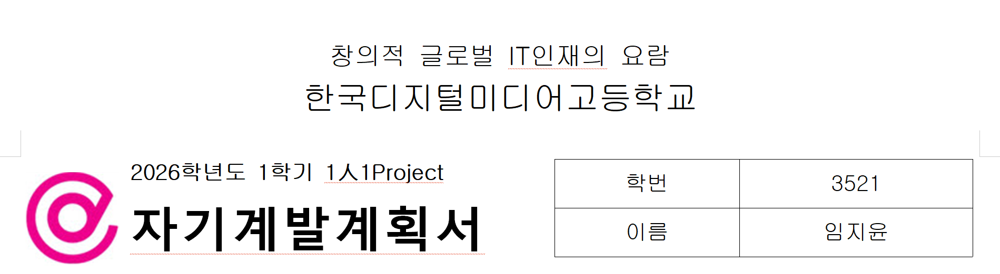
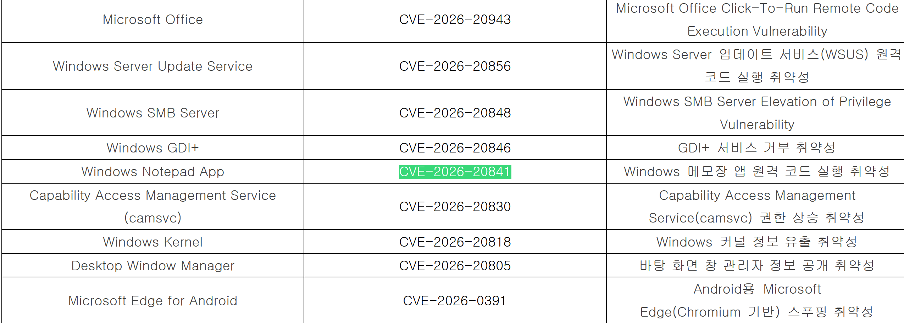

## General Industry 1人1P (1)
---

학교 3학년 공업일반 과목에서의 1인 1프로젝트 수행평가로 인해 유기했던 블로그를 오랜만에 작성한다. `CVE-2026-20841`에 대한 분석을 주제로 프로젝트를 진행할 예정인데, 프로젝트 내용 별로 총 8개 정도의 짧은 글을 작성하는 것을 목표로 한다.

## Subject Selection
---

올해 프로젝트의 경우 최대한 간단하고 흥미로운 주제를 선택했다. 작년 여름, Microsoft는 메모장 프로그램을 업데이트했다. 기존까지와는 다르게 마크다운 렌더링 기능과 미리보기 기능을 추가한 것이다. 마크다운을 자주 사용하는 나로서는 당시 이러한 새로운 기능에 좋아했던 기억이 있는데 그와 관련하여 취약점이 발생했다는 사실을 주제 탐색 중 알게 되었다.

그러나 이러한 업데이트는 공격 표면을 확대했고, 그 결과 마크다운 렌더링 기능에서 취약한 필터링 방식으로 인해 취약점이 발생하였다. 이번 취약점은 위험성이 꽤나 높지만 재현 난이도는 매우 낮은 편인데 간단한 주제를 찾고 있었던 나에게 적합하다고 생각했고, 모든 사람들이 흔히 쓰는 메모장에서 취약점이 발생하여 소소하게 화제된 것이 흥미로웠다.

## Planning
---

| 기간 | 내용 |
| --- | --- |
| 3월 | 주제 선정, 배경 지식 조사, `CVE-2026-20841` 관련 자료 수집 |
| 4월 | 가상환경 구축, Root Cause 분석 |
| 5월 | PoC 재현, 동작 검증, 정리 보고서 작성, PPT 제작 |
| 6월 | 최종발표, 보고서 및 발표 PPT 제출 |

주어진 기간이 꽤나 여유롭기 때문에 가상환경 구축 이후 직접 왜 취약점이 발생했는지 분석해보고, 동작을 재현해 본 후 수행평가용 보고서 이외의 내용 정리 보고서를 따로 작성하여 발표할 계획이다.

## Comment

[계획서 다운로드](https://github.com/tuplest/tuplest.github.io/tree/main/src/content/posts/260316/files)