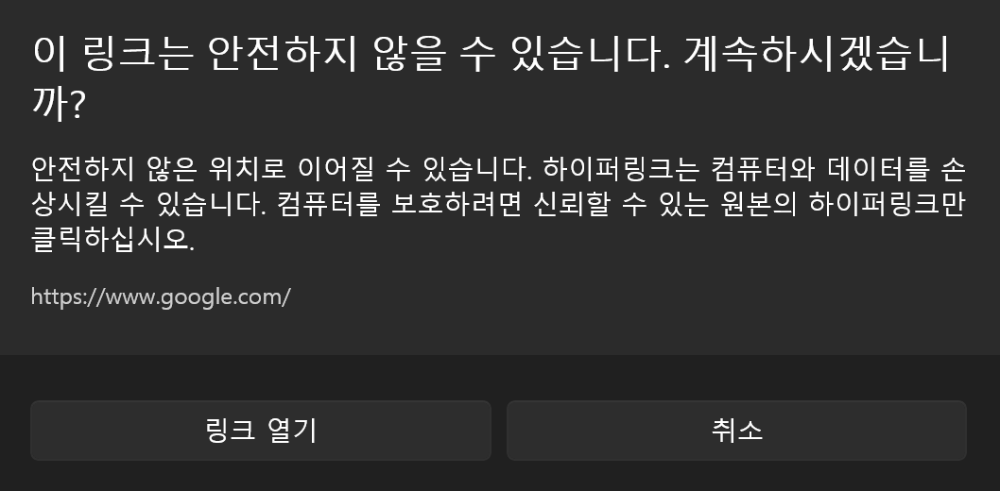
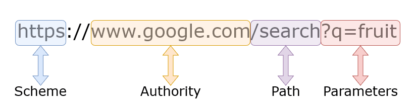

## General Industry 1人1P (2)

공업 일반 프로젝트 2번째 과정 정보 탐색이다. 해당 글에서는 `CVE-2026-20841`에 대한 정보를 탐색하고 정확한 이해를 위한 여러 배경 지식들을 정리하는 것을 목표로 한다.

## CVE-2026-20841

| 목차 | 내용 |
| --- | --- |
| Title | Windows Notepad App Remote Code Execution Vulnerability |
| Published | 2026-02-10 |
| Product | Windows Notepad |
| Affected | from `11.0.0` before `11.2512.26.0` |
| CWE | CWE-77: Improper Neutralization of Special Elements used in a Command (`'Command Injection'`) 
| CVSS | `7.8` (High) |

`CVE-2026-20841`는 2026년 2월 10일에 공개된 취약점으로, 윈도우의 메모장 프로그램에서 발생한 원격 코드 실행(RCE), 명령 주입(Command Injection) 취약점이다. CVSS 점수는 7.8로 위험도가 높은 것으로 평가되고 있다.

영향을 받는 프로그램의 버전은 `11.0.0`부터 `11.2512.26.0`으로 2025년 업데이트된 '마크다운 렌더링' 기능이 추가된 버전부터 `Microsoft`의 2026년 2월 보안 업데이트 전까지의 버전이다.

## Why?

마크다운 문법에는 `하이퍼링크 문법`이 있다. `[표시](하이퍼링크)`의 형식으로 작성하면 [표시](https://namu.wiki/w/%EC%A7%91%EC%97%90%EA%B0%80%EA%B3%A0%EC%8B%B6%EC%96%B4)와 같이 나타나는 문법이다. `표시`를 눌러보면 알 수 있듯이 누르면 그 링크를 통해 접속이 되는데 업데이트 직후의 메모장 프로그램은 링크의 주소로 넘어가는 과정에서 검증을 하지 않고 윈도우 내부 함수(ShellExecuteExW)로 넘겨버리기 때문에, 악성 링크에 취약해지게 되는 것이다.

위 사진은 패치 이후 버전의 메모장에서의 화면으로 링크를 누르면 안전한지 확인하라는 경고 창이 뜨는 것을 볼 수 있다.

## URI Scheme

`URI Scheme`이란 `URI`에서 `:` 문자 앞에 오는 첫 번째 부분을 말하는데, 리소스를 가져올 때 사용해야 하는 프로토콜을 지정하는 역할을 한다. 예를 들어 `https://www.google.com/`라는 링크가 있을 때 `https`를 말하는 것으로 해당 링크를 열 때 `https`를 사용해야 함을 의미한다.

해당 취약점에서 발생한 문제는 이 `URI Scheme`의 종류에 상관없이 모두 검증없이 열리게 한 것이다. 당장 `https`만 검증 없이 열어도 악성 사이트에 접속될 가능성이 존재하는데, `file`과 같은 스킴 또한 검증 없이 열어버리면서 시스템 프로그램까지도 실행할 수 있게 된 것이다.

## Comment

취약점 발생 코드에 대한 분석과 패치는 이후 글에서 자세하게 설명하도록 하겠다.