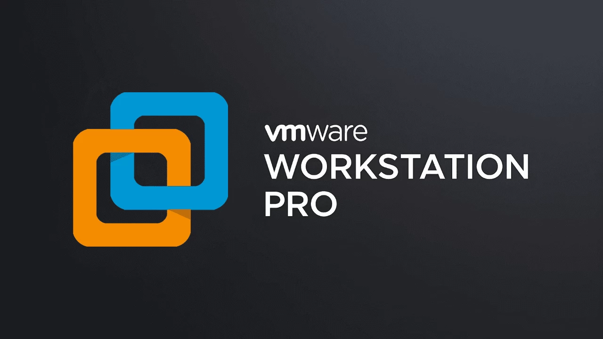
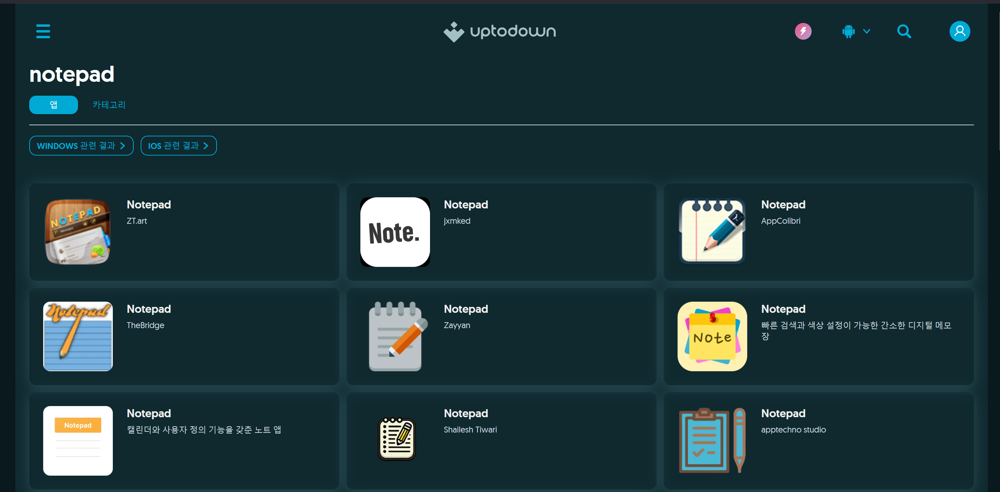

## General Industry 1人1P (3)

프로젝트 3번째 과정인 환경 세팅이다. 환경 설정만 끝내면 되기에 짧게 작성할 생각이다.

## Setting Up

기본적으로 보안 분석 환경은 가상 머신으로 구성하는 게 마땅하다. 특히 네트워크와 관련된 분석에서는 더더욱 네트워크를 고립시킨 가상 머신에서 하는 것이 바람직하다. 그러나 해당 취약점은 우리가 쓰는 윈도우11 환경(윈도우10의 경우 별도 설치)에서 발생한 취약점이고, 네트워크와는 관련이 없기에 그냥 본인의 호스트 컴퓨터에서 해도 될 것이다. 다만 나의 경우 따로 윈도우11 가상 머신을 설치해서 분석했다.

가상머신의 경우 `vmware workstation pro`를 사용했다. 나의 경우 대회와 프로젝트로 인해 이미 노트북에 설치되어 있어 그대로 사용하였다. 설치 방법은 구글링하면 많이 나오니 모르는 사람들은 참고하길 바란다.

윈도우11 또한 `.iso` 파일을 찾아 설치하여 주었다.

## Notepad

[uptodown](https://kr.uptodown.com/) 사이트에서 레거시 버전을 찾을 수 있어 여기서 설치하였다.

## Comment

환경 세팅이었다.