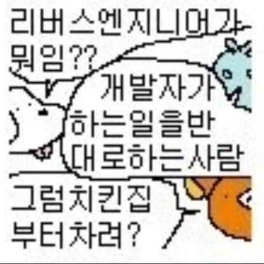

## General Industry 1人1P (5)

프로젝트 마지막 글이다. 간략하게 프로젝트를 마무리하며 느낀점 등을 적도록 하겠다.

## comment

이번 프로젝트의 경우, 1-day 분석이 목표였지만 시간적 한계로 인해 `CVE-2026-20841`로 난이도를 낮추어 진행하였다. 물론 처음 해보는 내용인만큼 지식이 부족하여 어려움이 있었던 적도 있지만 이에 경우 여러 자료를 찾아보며 해결할 수 있었다. 오랜만에 리버싱을 하면서 재밌게 할 수 있었고 다음에 더 시간이 여유가 있다면 더 내 지식의 발전에 도움이 될만한 주제를 선정하여 프로젝트를 진행하고 싶다는 생각이 들었다.